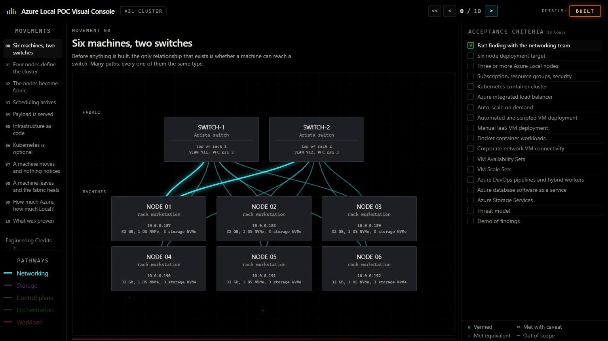
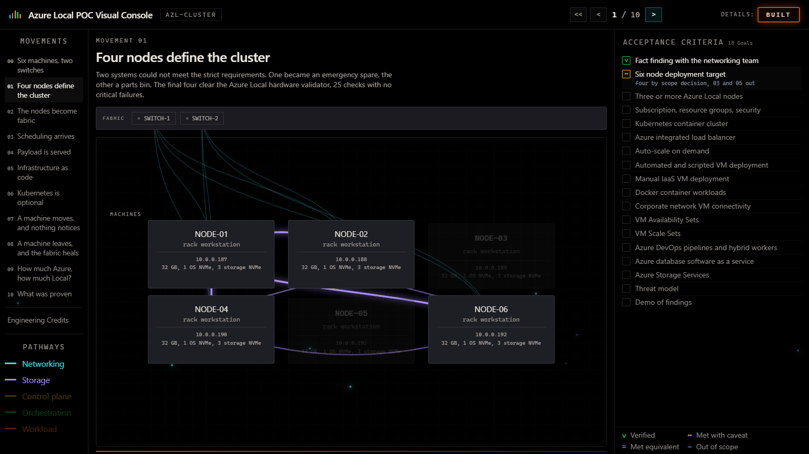
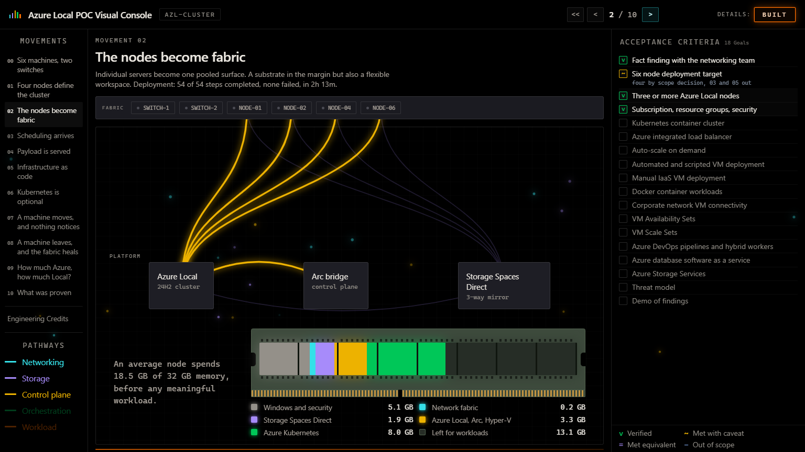
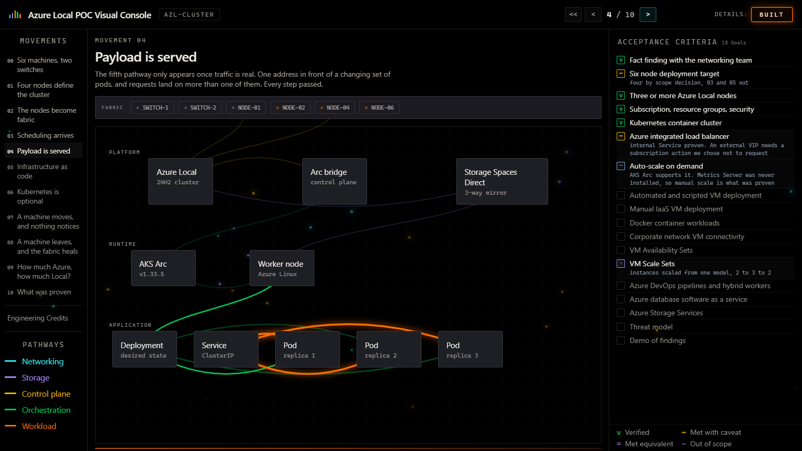
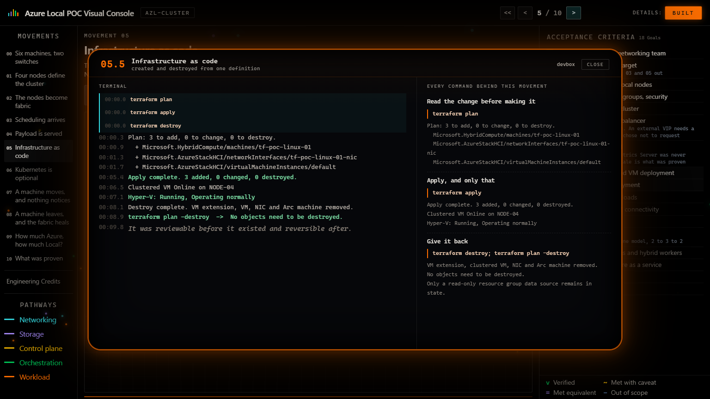

# Azure Local: from physical fabric to working workloads

**David Kurtz | Infrastructure engineering portfolio**

A four-node Azure Local proof of concept, with an interactive capstone that explains how physical networking, pooled storage, Azure management, Kubernetes, and application delivery fit together.

**Explore:** [Source repository](https://github.com/djaykurtz/AZLOCAL-POC) | [Interactive capstone](https://djaykurtz.github.io/AZLOCAL-POC/). The capstone is a static explanation of recorded engineering work, not a connection to a running lab.



## The engineering problem

Could available lab workstations become a managed Azure Local platform that hosts useful workloads, rather than merely registering hardware in Azure?

The difficult work was getting the prerequisites to agree: firmware and drivers, plain NVMe storage, switch configuration and adapter naming, directory permissions, security-agent boundaries, and limited memory. The accepted scope became four functional nodes from an initial six-machine inventory. This is a functional lab POC, not certified production infrastructure.

## Architecture

| Layer | Implementation and responsibility |
| --- | --- |
| Physical fabric | Four active rack workstations, paired switches, separate storage VLANs, RDMA and priority flow control |
| Local platform | Hyper-V and Storage Spaces Direct provide clustered compute and pooled storage |
| Azure management | Azure Arc Resource Bridge and a custom location connect local resources to the Azure control plane |
| Workload runtimes | AKS Arc schedules Kubernetes workloads; a separate Linux guest hosts Docker and Dockge |
| Application | A dashboard Deployment and internal ClusterIP Service demonstrate replica scaling, pod replacement, and in-cluster routing |
| Infrastructure as code | A human-operated Terraform definition creates, verifies, and removes a disposable Azure Local VM |





## What was demonstrated

The retained project records document a deployed four-node cluster, operational Storage Spaces Direct, an Arc Resource Bridge and custom location, and Windows and Linux guest workloads. VM lifecycle operations, live migration, and planned host-reboot recovery were exercised.

The container work includes Docker and Dockge in a Linux **guest**, not on Azure Local hosts. AKS Arc ran a dashboard workload with a two-replica baseline, a temporary scale to three replicas, replacement of a deleted pod, restoration of the baseline, and requests reaching multiple ready backends through the in-cluster Service. Terraform VM creation and destruction ended with a reconciled clean state.

These are recorded lab accomplishments, not newly executed infrastructure tests or measurements collected by the public page. See the [status snapshot](source/STATUS.md), [integration results](source/docs/planning/kubernetes-terraform-integration-test-results.md), and [acceptance traceability](source/docs/planning/acceptance-criteria-verification.md) for the precise evidence and caveats.



## Presentation versus implementation

The public capstone is a **self-contained HTML/CSS/JavaScript presentation**, not a live management console. Its topology, animations, portal-style views, acceptance indicators, and terminal replays explain the recorded engineering work. They do not query Azure, execute Terraform, reach the lab, or mutate Kubernetes. Portal views are reconstructions, not screenshots of a currently connected Azure session.

The original Kubernetes dashboard implementation is a separate artifact under [source/tests/kubernetes/azure-local-dashboard](source/tests/kubernetes/azure-local-dashboard/README.md). It combines fixture Azure inventory with read-only Kubernetes state when deployed inside the lab. The static capstone does not deploy or run that dashboard.

The limits matter: this POC does not establish production supportability, disaster recovery, performance capacity, or uninterrupted AKS service during the separate node-loss test. The external MetalLB VIP, HPA, additional node-pool capacity, database workloads, and production delivery pipelines are not claimed as completed. The historical source-validation workflow was authored but never run; this portfolio's Pages workflow is separate and packages only the static presentation.



## Run the capstone locally

No package installation, build step, cloud account, or credentials are needed for the presentation. From this directory:

```powershell
python -m http.server 8000 --bind 127.0.0.1 --directory .\docs
```

Open `http://127.0.0.1:8000/`. Stop the server with `Ctrl+C`. You can also open `docs\index.html` directly in a modern browser.

Choose **Begin**; clear the intro checkbox to go straight to the console, or use **Skip intro** during the introduction. Click a movement in the left rail to jump to it. The next/previous buttons and left/right arrow keys navigate. **BUILT** is armed by default: Next first opens the movement's cutaway, then advances on the next press. Toggle BUILT off for uninterrupted movement navigation; **Escape** closes a cutaway. The reset button returns to the overview.

The composition has a native 1536 x 864 stage and scales at the same 16:9 aspect ratio. The five screenshots above were captured from functioning presentation states at that native size, not from loading or title screens.

## Repository guide

| Path | Purpose |
| --- | --- |
| `docs/index.html` | Standalone public capstone and Pages entry point |
| `docs/assets/screenshots/` | Five representative presentation captures |
| `.github/workflows/pages.yml` | Static Pages artifact and deployment workflow, restricted to `docs/` |
| `source/README.md`, `source/STATUS.md` | Original engineering narrative and dated status |
| `source/docs/` | Decisions, runbooks, scope boundaries, and recorded results |
| `source/scripts/`, `source/infra/`, `source/tests/` | PowerShell automation, infrastructure definitions, and workload examples |
| `source/guide/` | Standalone Azure Local field guide |
| `source/capstone/`, `source/cap-prep/` | Capstone implementation, prototypes, and design material |
| `source/working/`, `source/archive/` | Historical work records and superseded material; not the static website |

The source layout is retained as a dated engineering snapshot under `source/`, with example environment identifiers. Commands and paths are relative to that directory and may describe environment-specific or historical behavior. Read the relevant runbook and configuration before running any infrastructure automation. Serving the capstone does not require executing these files.

## Reusing the infrastructure examples

The static presentation requires no account or corporate network. Actually provisioning Azure Local is a separate, operator-controlled task that needs your own Azure tenant/subscription, eligible permissions, supported region, prepared hardware, directory services, and suitable networking. The examples do not grant access to the original lab.

Replace example subscription/tenant IDs, resource names, hostnames, domains, network ranges, directory OUs, image/storage paths, and account names with values from your authorized environment. Authenticate Azure CLI to that tenant and verify the selected subscription before any deployment. Use identities and permissions you control; no former employer account, email, SSO session, internal service, or work-owned runner is required by the public Pages site.

Use PowerShell 7 for the retained Windows automation; some historical scripts use its syntax and UTF-8 handling. Individual operations also require their documented tools, permissions, and prepared Windows/AD/Azure environment. These scripts are examples to review and configure, not an unattended turnkey installation.

Credential helpers must use your own vault and secrets. `Sync-CredFromKeyVault.ps1` requires an explicit `-KeyVaultName`; `Save-LcmCredential.ps1` requires a vault name unless `-SkipKeyVault` is used for local-only storage. For example, from `source\scripts`, substituting your own vault:

```powershell
.\Sync-CredFromKeyVault.ps1 -KeyVaultName 'kv-lab-secrets'
.\Save-LcmCredential.ps1 -KeyVaultName 'kv-lab-secrets' -AccountName 'LAB\deployment-user'
```

To save only locally, use `.\Save-LcmCredential.ps1 -SkipKeyVault -AccountName 'LAB\deployment-user'`. DPAPI credential caches are tied to the Windows user and machine that created them: create fresh caches under your new account rather than relying on old work-profile files. The historical source-validation workflow is reference material; the active Pages workflow uses GitHub-hosted runners for this personal repository.

## Static hosting

Use **GitHub Actions** as this repository's Pages source. The workflow targets pushes to `main` that change the website or Pages workflow and also supports manual dispatch. It uploads **only `docs/`**; operational documentation, source code, archive material, and the original historical workflow are outside the Pages artifact.

The workflow uses official GitHub actions, read-only source access, a `github-pages` deployment environment, a single deployment concurrency group, and Pages/OIDC write permissions only in the deployment job. The public page has inline scripts, styles, and images, so no CDN, API, secret, package manager, or runtime service is required.

Publishing the static presentation does not provision Azure resources, deploy workloads, or connect to the original hardware.

No new license has been selected for this snapshot; publication alone does not grant a reuse license.
