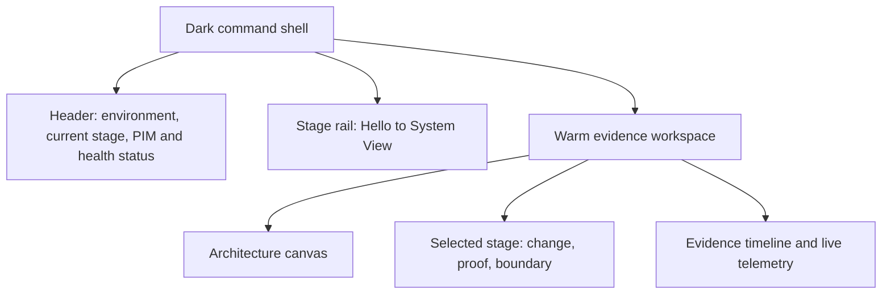

# Capstone Command Center design direction

## Direction

Use the Command Center design language from [Evreghen Command Center DESIGN.MD](https://designmd.ai/frknaykc/command-center) as the visual direction for the Azure Local learning console.

This is an adaptation, not a copy of the source implementation. The capstone remains an evidence-led Azure Local,
Terraform, GitHub Actions, and Kubernetes teaching tool.

## Why it fits

The reference separates a dark, translucent application shell from a light, warm, dense operational workspace. That
is a useful match for this project:

- The dark shell frames the environment, stage rail, and current system status.
- The light workspace carries the readable architecture, pipeline evidence, Terraform results, and Kubernetes state.
- Orange highlights the currently active stage and recent telemetry without turning the entire interface into an
  alarm screen.
- The restrained semantic palette makes verified, waiting, degraded, and blocked states easy to scan.

The reference describes its target as "focused, technical, and slightly premium rather than playful." That is the
right tone for a management-facing learning demo.

## Secondary inspiration - Pierre-Louis portfolio

Use [Pierre-Louis Labonne's interactive portfolio](https://pierrelouis.webflow.io/) as an inspiration for pacing
and progressive reveal, not as the base visual system.

The useful visual observations are:

- The entry begins with one physical, comprehensible action: a power button changes the viewer from a dormant
  introduction to an active dashboard.
- The revealed interface is assembled from tactile, distinct modules instead of one continuous generic page.
- Counters, toggles, arrows, and small control surfaces make exploration feel intentional and invite a viewer to
  discover the next layer.
- Dense panels can remain playful and memorable when their layout still makes the next action obvious.

For the Azure Local console, translate these ideas as follows:

| Portfolio interaction | Capstone adaptation |
| --- | --- |
| Turn-on entry gesture | `Start learning path` reveals the stage rail and begins at Hello. It must never trigger infrastructure work. |
| Tactile dashboard modules | Architecture nodes become compact instrument modules for Source, CI, Terraform, VM, AKS, Service, and Pods. |
| Physical counters | Show real counts: desired/ready replicas, EndpointSlice members, Terraform plan resource count, and evidence age. |
| Switches and knobs | Use as read-only stage filters and evidence toggles, never as a disguise for privileged Azure or Kubernetes actions. |
| Directional arrows | Highlight the currently evidenced path through the architecture graph. |
| Progressive reveal | Unlock the next visual layer only when a stage has verified evidence or an operator presents its recorded result. |

Avoid the portfolio's decorative character art, personal-branding composition, and playful controls where they
would obscure operational meaning. The Command Center shell remains the governing visual system; the portfolio
contributes narrative rhythm and the sense that modules are being powered on one at a time.

## Visual foundation

| Token | Capstone use |
| --- | --- |
| Warm workspace background `#fcfaf7` | Main evidence and learning surface. |
| Ink `#423d38` | Headings, architecture labels, and body copy. |
| Soft surface `#f3f4f6` | Quiet evidence panels, tables, and inactive stage content. |
| Elevated surface `#ffffff` | Selected stage and detailed proof panel. |
| Shell base `#000000` with translucent border | Header, left stage rail, and system status chrome. |
| Primary orange `#fe6e00` | Active stage, running pipeline step, focus ring, and selected architecture path. |
| Success `#00c758` | Verified and healthy state only. |
| Warning `#edb200` | Degraded-state risk, waiting approval, or stale evidence. |
| Danger `#fb2c36` | Failed test or explicit blocked action. |
| Info `#3080ff` | Read-only source, informational context, and pending discovery. |

Use compact system sans-serif type, 4px-based spacing, and small 4-8px corner radii. Use monospace only for
resource IDs, plan summaries, request IDs, image digests, and event timestamps.

## Layout



### Header

- Product name: `Azure Local Learning Console`.
- Environment badge: `AZL-CLUSTER-01`.
- Compact live state: cluster, AKS, dashboard replicas, current evidence freshness.
- Do not put a giant hero title or marketing language here.

### Stage rail

Use the Command Center sidebar treatment for eight progression stages:

```text
01 Hello
02 Container
03 Replicas
04 Recovery
05 CI Validation
06 Terraform Plan
07 Terraform Lifecycle
08 System View
```

Each row has a semantic status chip:

| Status | Meaning |
| --- | --- |
| Verified | Evidence is complete and reproducible. |
| Active | The audience is currently examining this stage. |
| Ready | Prerequisites exist but the stage has not been demonstrated. |
| Waiting | Approval, pipeline run, or asynchronous work is in progress. |
| Degraded | The capability remains available but has a declared maintenance risk. |
| Blocked | A known external permission or platform dependency prevents the stage. |

### Architecture canvas

Use durable nodes and connectors, not decorative animation:

```text
Source -> GitHub Actions -> Terraform Plan -> Approved VM Lifecycle
                         -> Container Image -> AKS Deployment -> Service -> Pods
```

Only highlight a connector when the selected stage has attached evidence. Example: selecting Terraform Lifecycle
highlights the `tf-poc-linux-01` resource path and its cleanup evidence; selecting Replicas highlights Deployment,
ReplicaSet, EndpointSlice, and pod nodes.

### Evidence detail panel

Every selected stage has exactly three compact blocks:

1. `What changed`
2. `What proves it`
3. `Boundary`

Example for Terraform Lifecycle:

```text
What changed
  Terraform created a disposable Azure Local VM, NIC, and Arc machine parent.

What proves it
  VM Online on AZL-NODE-04; final cleanup plan had no objects to destroy.

Boundary
  ARM status lagged Hyper-V runtime; this is not yet a pipeline-grade unattended lifecycle.
```

## Interaction language

The page must use familiar visual control types:

- Stage rail: navigation list, not pill tabs.
- Architecture nodes: selectable cards with a visible focus state.
- Evidence timeline: filter menu by source and status.
- Bounded work: an icon button with tooltip and a visible fixed-run count.
- Refresh: icon button with freshness timestamp.
- Operator actions: show a locked command card and approval state, not a clickable browser action.

The browser remains an observer and explainer. It does not acquire Azure write credentials, a Kubernetes
administrator kubeconfig, Terraform state credentials, or PIM credentials.

## State and motion

Use motion only to communicate a real change:

- A stage connector draws in when verified evidence is loaded.
- A small status transition animates from `Waiting` to `Verified` after a real workflow artifact or Kubernetes
  API refresh confirms it.
- Pod nodes appear and leave the architecture canvas when the live Kubernetes API state changes.
- The learning-path entry can transition from an intentionally quiet onboarding screen to the active command
  workspace. This is a presentation transition only and must not start a workflow, scale a Deployment, or apply
  infrastructure.
- Do not use ambient particles, gradient orbs, loading loops without progress meaning, or animated fake terminals.

## Stage-specific visual mapping

| Stage | Primary visual | Live evidence |
| --- | --- | --- |
| Hello | Warm workspace card with HTTP and pod identity | `/api/hello`, `/healthz` |
| Container | Image/digest card | `APP_VERSION`, image metadata, structured log |
| Replicas | Deployment -> ReplicaSet -> pod row diagram | desired/ready/available, EndpointSlices |
| Recovery | Removed pod fades; replacement pod enters | Kubernetes Event and replacement name |
| CI Validation | Job-step ladder in the dark shell | GitHub workflow run artifact |
| Terraform Plan | Textual change summary with allowlist verdict | `3 add, 0 change, 0 destroy` |
| Terraform Lifecycle | VM node appears, is verified, then archived as cleaned | lifecycle evidence artifact and findings |
| System View | Full architecture with source labels | merged evidence and live Kubernetes state |

## Degraded-state treatment

The node 01 disk condition should be visible but quiet:

```text
Storage maintenance condition
1 retired NVMe path; three-way mirror remains available.
Small POC tests allowed. Storage mutation and stress are deferred.
```

Use an amber status treatment in the header and evidence timeline. Do not let it dominate the page or falsely
turn an available POC into a red outage display.

## Implementation sequence

1. Define the CSS tokens above in the custom dashboard application source.
2. Replace the current simple page layout with dark shell, stage rail, and warm workspace.
3. Introduce `stages.json` and sanitized evidence JSON as read-only ConfigMap assets.
4. Render current Kubernetes state into the architecture canvas.
5. Add Terraform lifecycle evidence from the completed test.
6. Add GitHub Actions workflow evidence after the curated workflow is pushed.
7. Verify desktop and mobile layouts with screenshots before using the interface in a presentation.

## Source

- [Evreghen Command Center DESIGN.MD](https://designmd.ai/frknaykc/command-center)
- [Self-building demo interaction research](interaction-research.md)
- [Self-building Azure Local learning demo](self-building-learning-demo.md)

