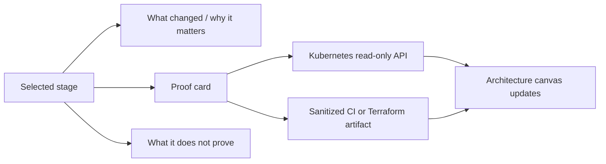

# Self-building demo interaction research

## Research conclusion

The capstone should not simulate automation. It should make actual automation legible.

The most useful reference patterns combine:

1. A visible continuous-integration information radiator.
2. Terraform's explicit write -> plan -> apply workflow.
3. Kubernetes desired state, rollout, EndpointSlice, and recovery signals.
4. Progressive disclosure: show one layer of the architecture only after its evidence is present.

This produces an interactive teaching console rather than a slide deck or an unbounded control panel.

## Design principles from the sources

| Source pattern | What it means for the demo |
| --- | --- |
| GitHub Actions workflows are event-triggered YAML processes composed of jobs and steps. | Treat a workflow run as a durable, versioned evidence object tied to commit SHA, trigger, jobs, and status. |
| Terraform's core workflow is write -> plan -> apply. | Make plan review a first-class stage. Do not collapse plan and apply into one visual action. |
| Kubernetes Deployment reconciles desired state through ReplicaSets and Pods. | Show desired, updated, ready, and available replica counts, then connect them to pod and Event evidence. |
| Kubernetes Services maintain EndpointSlices as matching Pods change. | Show endpoint membership changing with scale and recovery. Do not claim port-forward tests prove Service load balancing. |
| CI works best when the build is fast, self-testing, visible, and failures are fixed promptly. | Keep source validation fast and always visible. Build later integration stages from saved, sanitized evidence. |

Sources:

- [GitHub Actions workflows](https://docs.github.com/en/actions/concepts/workflows-and-actions/workflows)
- [Terraform core workflow](https://developer.hashicorp.com/terraform/intro/core-workflow)
- [Kubernetes Deployments](https://kubernetes.io/docs/concepts/workloads/controllers/deployment/)
- [Kubernetes Services and EndpointSlices](https://kubernetes.io/docs/concepts/services-networking/service/)
- [Continuous Integration](https://martinfowler.com/articles/continuousIntegration.html)

## Interaction model

The page uses a stage manifest. Each stage is a versioned record with:

```json
{
  "id": "terraform-plan",
  "title": "Terraform Plan",
  "state": "verified",
  "source": "sanitized evidence artifact",
  "whatChanged": "A disposable Azure Local VM was described as code.",
  "proof": "3 to add, 0 to change, 0 to destroy.",
  "boundary": "A plan previews change. It does not create a VM.",
  "evidenceIds": ["tf-plan-20260818"]
}
```

The frontend renders this manifest as a stage rail and progressively reveals related architecture nodes. The
backend attaches live Kubernetes facts only where it has a read-only source.



## Controls by safety tier

### Tier 1 - Viewer controls

These controls are safe for the interactive page:

- Select and expand a stage.
- Refresh read-only Kubernetes state.
- Inspect pod, ReplicaSet, EndpointSlice, and Event details.
- Run one bounded work request or the fixed 10-second burst.
- Filter evidence by run ID, commit SHA, component, or status.
- Compare a saved Terraform plan summary to the final cleanup summary.

### Tier 2 - Operator-present demonstration controls

The page may explain these actions and show their progress, but an operator performs them separately from a
documented terminal or approved workflow:

- Scale the existing dashboard from two to three replicas.
- Delete one dashboard pod to demonstrate Deployment self-healing.
- Start an approval-gated Terraform plan or apply workflow.
- Create and later destroy the Terraform-owned disposable VM.

The page receives the resulting Events and sanitized evidence; it does not receive Kubernetes or Azure write
credentials.

### Tier 3 - Never a page control

- Azure Local host reboot, storage repair, disk removal, BIOS, switch, AD, or role assignment changes.
- Terraform state repair, import, or destroy outside the dedicated POC module.
- AKS worker-node scale while the POC storage maintenance condition remains open.

## Background work design

The phrase "builds itself" should mean the system visibly progresses through pre-approved work, not that the
browser initiates opaque privileged actions.

| Background action | Trigger | What the page shows | Delivery rule |
| --- | --- | --- | --- |
| Source validation | Push, pull request, or manual GitHub workflow | Job graph, commit SHA, pass/fail, timestamps | Automatic and credential-free. |
| Terraform plan | Approved OIDC plan workflow | Resource count and allowlist verdict | Publish a sanitized JSON summary, never raw plan or state. |
| Terraform apply/destroy | Protected environment approval | Queued, approved, running, verified, cleanup states | Human approval and separate pipeline identity. |
| Dashboard rollout | Approved app-delivery workflow | Image digest, revision, rollout progress, endpoint count | Limit scope to dashboard namespace. |
| Kubernetes scale/recovery | Operator command during demo | Desired/ready counts, replacement Event, endpoint change | Restore to two replicas automatically in the runbook. |

## Evidence artifact contract

The page should consume small, append-only JSON artifacts. Do not query GitHub, Terraform state, or Azure control
plane directly from the browser.

```json
{
  "schemaVersion": "1.0",
  "runId": "tf-lifecycle-20260819",
  "component": "terraform",
  "status": "verified-with-findings",
  "sourceRevision": "<git-sha>",
  "startedAt": "2026-08-19T00:00:00Z",
  "completedAt": "2026-08-19T00:00:00Z",
  "summary": {
    "planned": { "add": 3, "change": 0, "destroy": 0 },
    "runtime": "Online on AZL-NODE-04",
    "cleanup": "no objects to destroy"
  },
  "findings": [
    "Azure Local ARM completion lagged Hyper-V runtime success.",
    "Residual NIC cleanup required active PIM elevation."
  ]
}
```

For the first phase, deliver artifacts as reviewed ConfigMaps mounted read-only into the dashboard. Later, a
pipeline can update a dedicated ConfigMap through a narrowly scoped deployment identity.

## Recommended visual language

- Use an architecture canvas with durable nodes, not a decorative animated flow chart.
- Make state changes visible with timestamps and direct source labels: `Live Kubernetes API`, `Terraform evidence`,
  `GitHub workflow evidence`, or `Static POC boundary`.
- Use green only for verified state, amber for waiting or degraded-state risk, and red for a real failed test.
- Give every stage a compact boundary line. Example: `Verified VM runtime does not imply ARM completion was timely.`
- Use a fixed stage rail so the audience can retain orientation while individual panels expand.
- Preserve failures as teaching material. The Terraform ARM `Accepted` lag and PIM-expired NIC cleanup are useful
  evidence of why mature delivery systems need state reconciliation and time-bounded access checks.

## First implementation slice

1. Add `stages.json` and `evidence/terraform-lifecycle.json` to the dashboard source.
2. Render a top stage rail and expandable stage cards.
3. Mount the two evidence files through a read-only ConfigMap.
4. Add a backend endpoint that merges the static stage manifest with live Kubernetes state.
5. Add the Terraform lifecycle stage using the completed test result.
6. Add the Kubernetes scale/recovery stage using the completed integration test result.
7. Keep the existing work-burst and refresh controls; do not add write controls.

## Validation plan

- Unit-test the stage manifest schema and evidence schema.
- Test missing artifact and stale timestamp states in the UI.
- Test that a Kubernetes API error leaves the last successful state visible and labeled stale.
- Verify every live claim on the page maps to an API field, Event, or evidence artifact.
- Verify every privileged action remains outside the browser process and has a separate operator or workflow record.

## Related records

- [Self-building Azure Local learning demo](self-building-learning-demo.md)
- [Kubernetes and Terraform integration test results](../docs/planning/kubernetes-terraform-integration-test-results.md)
- [Terraform and CI/CD capstone plan](terraform-cicd-plan.md)

