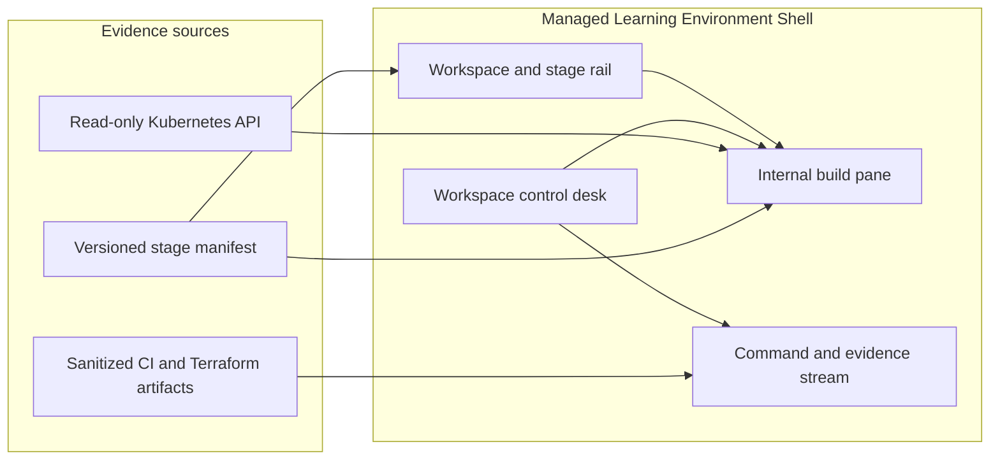

# Product architecture

## Product intent

Build an integrated webpage where a stable, managed learning-environment shell contains a product pane that grows
from a simple internal page into a visible Azure Local learning system.

The shell explains and records the work. The product pane shows what has actually been built. The relationship is
symbolic but grounded in evidence:

```text
Managed environment -> source -> pipeline -> infrastructure -> application -> evidence
```

## Application composition



## Managed shell

The outer webpage is permanent across every scenario. It borrows the operational clarity of VS Code rather than
the structure of a marketing site.

| Region | Responsibility | Contents |
| --- | --- | --- |
| Header | Context and health | `AZL-CLUSTER-01`, current learning workspace, evidence freshness, PIM/maintenance state. |
| Left rail | Orientation | Stage sequence, architecture layers, workspaces, and current selection. |
| Main pane | Active product | The page or system currently being built and explained. |
| Right rail | Narrative evidence | Structured command stream, workflow artifacts, plan summaries, Kubernetes Events, warnings, and timestamps. |
| Bottom desk | Session control | Workspace selector, scenario selector, start, advance, refresh, bounded work, and evidence detail controls. |

The shell must remain governed: it may visualize operator or pipeline actions, but it never stores Azure write
credentials, administrator kubeconfigs, Terraform state credentials, or PIM credentials.

## Internal build pane

The main pane is the integrated product under construction. It begins deliberately plain and gains durable modules
only as the supporting technology is verified.

| Layer | Appears when | Module shown |
| --- | --- | --- |
| Hello | Basic HTTP workload is verified | Greeting, pod identity, HTTP health. |
| Container | Image/build metadata exists | Version, digest, request ID, structured log link. |
| Kubernetes | Deployment and Service are verified | Deployment, ReplicaSet, pod, and EndpointSlice modules. |
| Recovery | Self-heal evidence is available | Deleted pod and replacement timeline. |
| CI | Source-validation workflow evidence exists | Commit, job graph, validation result. |
| Terraform | Plan/lifecycle evidence exists | Plan summary, VM path, runtime, cleanup, and findings. |
| System view | All preceding evidence is loaded | Connected architecture and declared boundaries. |

The main pane does not fake a new capability. A module is locked, waiting, verified, degraded, or blocked based on
an evidence record or live API fact.

## Workspace model

A workspace is a reproducible learning session, not a new Azure environment.

```json
{
  "id": "kubernetes-recovery",
  "title": "Kubernetes Recovery",
  "mode": "operator-present",
  "stages": ["hello", "replicas", "recovery"],
  "evidence": ["k8s-integration-20260819"],
  "allowedControls": ["refresh", "bounded-work", "open-evidence"],
  "operatorRunbook": "scale and delete-pod demonstration"
}
```

Workspaces provide a starting state, stage sequence, evidence collection, allowed viewer controls, and a link to
the operator runbook. Creating one never provisions cloud resources by itself.

Suggested initial workspaces:

| Workspace | Purpose |
| --- | --- |
| Hello Kubernetes | One internal page, health, pod identity, and request correlation. |
| Kubernetes Recovery | Scale `2 -> 3`, endpoint membership, pod replacement, restore to `2`. |
| Terraform Lifecycle | Plan, VM runtime evidence, ARM completion lag, state reconciliation, and cleanup. |
| Delivery Pipeline | Source validation and later GitHub Actions evidence. |
| Full System | All verified layers and declared POC boundaries. |

## Command stream

The right rail has a terminal-like visual language but contains structured evidence, not simulated commands.

```text
01:12:04  [terraform.plan]  3 add / 0 change / 0 destroy
01:12:18  [azure-local]     VM runtime online on AZL-NODE-04
01:12:22  [finding]         ARM resource remains Accepted
01:12:34  [terraform.state] extension imported for reconciliation
01:13:02  [cleanup]         final destroy plan: no objects
```

Every row has a timestamp, source, semantic status, short message, expandable evidence payload, and an optional
link to an architecture node. This lets the audience understand work as it happens without receiving an arbitrary
shell.

## Control desk

| Control | Effect | Safety boundary |
| --- | --- | --- |
| Workspace selector | Changes learning session | Changes only browser state. |
| Scenario selector | Chooses predefined stage sequence | Does not provision infrastructure. |
| Start learning path | Reveals the selected workspace from its plain starting state | Presentation transition only. |
| Advance | Moves to the next verified evidence stage | Cannot bypass a missing artifact. |
| Refresh live state | Reads Kubernetes data | Read-only ServiceAccount. |
| Run bounded work | Calls fixed `/api/work` request | Existing CPU/resource limits apply. |
| Open evidence | Shows sanitized artifact payload | No raw state, credential, or kubeconfig data. |
| Operator action required | Shows locked runbook card | Scaling, deletion, apply, and destroy happen outside the browser. |

## Evidence contract

The shell consumes small, append-only JSON artifacts. It never reads Terraform state or GitHub credentials in the
browser.

```json
{
  "schemaVersion": "1.0",
  "runId": "tf-lifecycle-20260819",
  "component": "terraform",
  "status": "verified-with-findings",
  "sourceRevision": "<git-sha>",
  "summary": {
    "planned": { "add": 3, "change": 0, "destroy": 0 },
    "runtime": "Online on AZL-NODE-04",
    "cleanup": "no objects to destroy"
  },
  "findings": [
    "Azure Local ARM completion lagged Hyper-V runtime success.",
    "Residual NIC cleanup required active PIM elevation."
  ]
}
```

Initial delivery uses reviewed read-only ConfigMap assets. A later, narrowly scoped pipeline identity may update a
dedicated evidence ConfigMap after a verified workflow completes.

## Visual identity

The product uses two complementary inspirations:

- **Command Center:** dark translucent shell, warm light evidence workspace, compact operational density, orange
  active path, and restrained status colors.
- **Pierre-Louis portfolio:** a quiet-to-active entry moment, tactile modules, real counters, directional paths,
  and progressive reveal.

The entry control becomes `Start learning path`. It moves from an intentionally quiet onboarding frame to the
active workspace, but never starts a workflow, scales a Deployment, or applies infrastructure.

## Safety tiers

### Viewer controls

- Browse stages and architecture nodes.
- Refresh Kubernetes state.
- Run bounded work.
- Inspect evidence, Events, plan summaries, and boundaries.

### Operator-present actions

- Scale the dashboard from two to three replicas.
- Delete one dashboard pod.
- Run an approval-gated Terraform apply or destroy workflow.

The shell reports these actions; the operator or protected pipeline performs them.

### Excluded actions

- Storage repair, disk removal, host reboot, BIOS, switch, AD, and PIM changes.
- Terraform import or state repair from a browser action.
- AKS worker-node scale while the storage maintenance condition is open.

