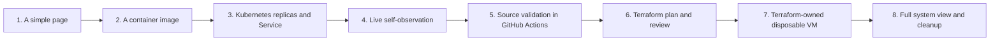
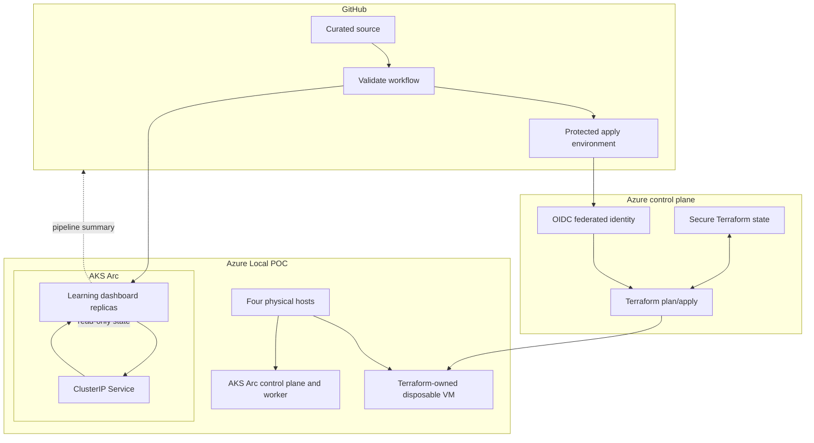

# Self-building Azure Local learning demo

## Ultimate goal

Build an educational capstone experience that explains Azure Local, Terraform, GitHub Actions, containers, and Kubernetes by revealing a real working system in stages.

The audience does not watch a static slide deck. They begin at a simple internal webpage and see the architecture, capabilities, and evidence expand as each preplanned stage is validated and released. The final page is a self-observing operations dashboard and an honest record of how it was assembled.

The experience must be visually compelling, technically real, safe on the four-node POC, and explicit about what is prebuilt versus what is being demonstrated live.

## Presentation promise

> Each stage adds one understandable capability, proves it works, shows what component delivered it, and exposes the evidence without hiding the limits of the POC.

The demo should teach this progression:



At no point should the page pretend that it created a physical Azure Local host, added a Kubernetes worker,
or bypassed a manual approval. The visual story must distinguish between:

$$
\text{source validation} \ne \text{infrastructure plan} \ne \text{approved apply} \ne \text{Kubernetes replica scale}
$$

## User experience

The page is a full-screen operations and learning console, not a marketing site. The top frame remains visible
throughout the presentation and contains the architecture map, current stage, verification state, and a concise
POC capacity banner.

Visual direction: [Capstone Command Center design](command-center-design.md), adapted from the referenced
Command Center DESIGN.MD system.

Interaction pacing inspiration: [Pierre-Louis portfolio patterns](command-center-design.md#secondary-inspiration---pierre-louis-portfolio).

### Persistent top frame

| Area | Content | Source |
| --- | --- | --- |
| Stage rail | Eight stage markers with `Ready`, `Running`, `Verified`, `Blocked`, or `Deferred` state. | Static release manifest plus live application state. |
| Architecture canvas | A diagram progressively fills in source, CI, Terraform, Azure Local VM, AKS, Service, pods, and evidence links. | Versioned stage definitions and live Kubernetes API data. |
| Evidence strip | Latest request ID, application version, Git commit, workflow result, Terraform plan/apply result, and data freshness. | Build metadata, ConfigMap, pipeline artifact summary, and live APIs. |
| Capacity banner | Four-node POC, current worker shape, dashboard replicas, and an explicit capacity-boundary message. | Static POC configuration plus live Kubernetes state. |

### Stage content

Each stage has three fixed elements:

- **What changed**: one plain-language explanation.
- **What proves it**: live response, workflow result, plan output, resource state, or Kubernetes event.
- **What it does not prove**: a concise boundary preventing a POC capability from being misrepresented as production readiness.

## Stage modules

| Stage | Capability revealed | Actual technical artifact | Demonstration action | Evidence shown |
| --- | --- | --- | --- | --- |
| 1. Hello | The cluster can host an internal web workload. | `azure-local-dashboard` Deployment and ClusterIP Service. | Open the page through local port-forward. | Pod identity and HTTP `200`. |
| 2. Container | A versioned application image defines the runtime. | Custom dashboard image, Dockerfile, immutable image tag. | Show image version and build metadata. | Image digest, version header, structured request log. |
| 3. Replicas | Kubernetes maintains desired application copies. | Deployment and ReplicaSet. | Manually scale from two to three replicas. | Desired/ready count, new pod, EndpointSlice member. |
| 4. Recovery | Kubernetes replaces failed workload instances. | Deployment controller, readiness/liveness probes. | Operator deletes one pod. | Replacement pod and controller Event. |
| 5. CI validation | Changes are checked before deployment. | GitHub Actions validation workflow. | Show completed workflow for the source revision. | Terraform, Kubernetes, and PowerShell validation results. |
| 6. Terraform plan | Infrastructure intent is reviewed before change. | `azlocal-disposable-vm` plan-only module. | Show speculative plan for one `tf-poc-` VM. | Plan contains only Terraform-owned creates. |
| 7. Terraform apply | A disposable VM can be created and cleaned up under approval. | Protected environment, OIDC identity, remote state, Terraform module. | Approve apply after a fresh plan. | VM ID, state, output, drift plan, and eventual destroy. |
| 8. System view | The stack has connected but separate control planes. | Dashboard backend joins pipeline summary, Terraform outputs, and Kubernetes live state. | Expand the completed architecture. | End-to-end evidence and explicit unresolved gates. |

Stages 1 through 5 can be prepared and demonstrated without an Azure deployment identity. Stage 6 is plan-only
until the real provider contract is proven. Stage 7 requires explicit approvals, OIDC, remote state, and current
capacity validation. It is not a button press from the public or local browser page.

## Virtual architecture



## Application architecture

### Frontend

- Single-page application shell with a stable top frame and stage-driven content region.
- Architecture graph model stored as versioned JSON, not hard-coded in presentation markup.
- Every revealed capability is tied to an evidence object with timestamp, source, status, and correlation ID.
- Live state uses a deliberate refresh interval and visible freshness state.
- Browser controls remain safe: refresh, expand stage, run bounded work, and open evidence detail. No direct
  Terraform apply, VM deletion, cluster scaling, or pod deletion control is exposed to viewers.

### Dashboard backend

- Serve the UI, current stage manifest, build metadata, and application health.
- Read namespace-scoped Kubernetes state through the existing read-only ServiceAccount.
- Normalize Deployment, ReplicaSet, pod, Service EndpointSlice, and Event data into a stable API contract.
- Receive or periodically retrieve sanitized pipeline and Terraform summary artifacts, not credentials or raw state.
- Return correlation headers and structured request logs from every API call.
- Cache the last known successful state and show stale/error states rather than blanking the presentation.

### Build metadata contract

Every custom image and deployment should carry:

| Field | Example | Purpose |
| --- | --- | --- |
| `app.kubernetes.io/version` | Git commit SHA or immutable tag | Connect running pod to source revision. |
| `poc.azurelocal.example.com/stage` | `kubernetes-lab` | Identify the active teaching stage. |
| `poc.azurelocal.example.com/change` | Workflow run or release ID | Trace the intended change. |
| `X-Request-ID` | Per-request UUID | Correlate browser response to pod log. |
| `X-App-Version` | Image version | Confirm the serving runtime version. |
| Terraform output summary | VM ID and provisioning state only | Show infrastructure result without exposing state secrets. |

## Terraform design

Terraform is used for the infrastructure learning stage, not to take over the entire existing POC.

### Module layout

```text
tests/terraform/
  poc-smoke/                 # Existing provider-free CI contract
  azlocal-disposable-vm/     # New real-provider plan/apply module
    versions.tf
    providers.tf
    variables.tf
    data.tf
    vm.tf
    outputs.tf
    terraform.tfvars.example
```

### Ownership rules

- Existing Azure Local cluster, custom location, gallery images, AKS, and shared logical network are data inputs only.
- `ws2025-core-01` and `rocky-docker-01` are historical manual evidence. Terraform must never import or manage them.
- New resources use an unmistakable `tf-poc-` prefix and Terraform ownership tags.
- The first module creates at most one small VM and its dependent NIC. A new dedicated logical network is created
  only if existing shared networking cannot be safely referenced.
- Destroy is limited to resources in the Terraform state. The plan must be reviewed before every apply and destroy.

### Provider and state sequence

1. Read the live ARM shape and API version for a Terraform-owned target resource.
2. Prefer typed provider resources only where their schema matches the live Azure Local resource contract.
3. Use `azapi` for unsupported or preview Azure Local resource types, with the API version explicitly pinned.
4. Start with interactive plan-only authentication on the DevBox.
5. Introduce remote state with locking before any shared or pipeline apply.
6. Introduce GitHub OIDC only after defining the repository, branch, environment, and minimal Azure RBAC scope.
7. Require protected-environment approval for apply and destroy.

## CI/CD design

### Pipeline 1 - Source validation

Status: implemented locally and ready to be committed.

- Terraform formatting, backend-free init, validation, and provider-free plan.
- Kubernetes client-side manifest validation.
- PowerShell parser validation.
- No Azure login, no secrets, no state backend, no registry push, and no apply.

### Pipeline 2 - Infrastructure plan

Add only after the Terraform provider feasibility module is stable.

- GitHub OIDC login with a narrowly scoped identity.
- Remote Terraform state with locking.
- `terraform plan` against the disposable VM module.
- Publish a redacted plan summary and resource-count assertion.
- Fail if the plan touches any non-`tf-poc-` resource.
- No apply from pull requests.

### Pipeline 3 - Approved infrastructure apply

Add only after Pipeline 2 and protected-environment design are reviewed.

- Re-run plan from the approved commit.
- Require an environment approval.
- Apply only the disposable VM module.
- Collect non-sensitive Terraform outputs.
- Run a post-apply drift plan.
- On a separately approved run, destroy the same module and prove final no-change state.

### Pipeline 4 - Application delivery

Add after selecting an image registry and deployment identity.

- Build custom dashboard image.
- Publish immutable tag and digest.
- Update only `azure-local-dashboard` deployment image reference.
- Wait for rollout and run internal HTTP/API smoke checks.
- Publish deployment metadata for the dashboard evidence strip.

## Safety model for a live presentation

The presentation can feel live without improvising production-like changes in front of an audience.

| Action | Prebuilt or live | Safety rule |
| --- | --- | --- |
| Open and progress through dashboard stages | Live UI | Read-only state and fixed stage metadata. |
| Show CI validation result | Prebuilt completed run | Never depend on a runner completing during the presentation. |
| Run bounded work burst | Live | Fixed request count and duration; current pod CPU limits remain enforced. |
| Scale 2 to 3 replicas | Live operator action | Perform only after current worker capacity check. |
| Delete one pod | Live operator action | Explicitly identify it as a controlled self-heal test. |
| Show Terraform plan | Prebuilt or live plan-only | Must show only `tf-poc-` creates. |
| Terraform apply or destroy | Optional live, approved | Use protected approval and a pre-rehearsed runbook. Keep a pre-recorded fallback. |

Never let the dashboard browser itself hold Azure or Kubernetes write credentials. The presentation page explains
and observes actions; it does not become an unguarded control plane.

## One-sprint build plan

### Week 1 - Foundation

- Commit the curated source-only CI workflow.
- Install Terraform on the DevBox and complete the provider-free module check.
- Capture exact Azure Local ARM resource contracts and create the provider feasibility module.
- Refactor the current ConfigMap prototype into versioned application source and a Dockerfile.
- Define stage JSON, evidence schema, and architecture graph model.

### Week 2 - Learning dashboard

- Implement top frame, architecture canvas, stage rail, evidence strip, and capacity banner.
- Keep existing Kubernetes Lab data and add stage-oriented presentation views.
- Add image build metadata, request correlation, and dashboard backend API normalization.
- Rehearse replica scale and self-healing with a controlled capacity gate.

### Week 3 - Terraform and pipeline integration

- Finish plan-only real-provider Terraform module.
- Decide remote state and OIDC only if the plan is stable and external identity work is approved.
- Add plan summary artifact ingestion to the dashboard.
- Build the application delivery workflow only after the registry choice is made.

### Week 4 - Rehearsal and evidence

- Run the complete director demonstration multiple times.
- Capture fallback artifacts for CI, Terraform plan, and any optional apply/destroy action.
- Validate cleanup and no-drift state.
- Produce a concise management summary: capability, evidence, capacity boundary, dependencies, and next investment.

## Success criteria

- The presentation page explains each system from its own live or verifiable evidence.
- A source change can be validated through GitHub Actions without Azure credentials.
- Terraform can produce a reviewed plan for one isolated Azure Local VM without touching existing resources.
- If promoted, Terraform creates and destroys only its isolated VM resources.
- Kubernetes demonstrates replicas, request routing, Events, and self-healing on the existing AKS worker.
- Every automation identity is least privilege and every destructive step requires a deliberate approval.
- The final presentation clearly states what the POC did not prove: production scale, high availability, public ingress, DR, and unrestricted automation.

## Related records

- [Terraform and CI/CD capstone plan](terraform-cicd-plan.md)
- [Terraform sprint plan](../working/sprints/terraform-against-cluster.md)
- [Azure permissions and capability register](../docs/access/azure-permissions-and-capability-register.md)
- [External dependencies and POC lessons](../docs/planning/external-dependencies-and-poc-lessons.md)

