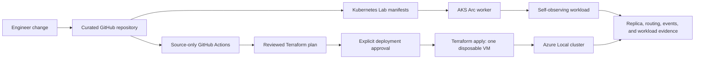

# Terraform and CI/CD capstone plan

## Executive purpose

Use the four-node Azure Local POC to demonstrate a disciplined delivery model on constrained infrastructure:

1. Source changes are validated automatically.
2. Infrastructure changes are previewed before they can affect the cluster.
3. One small, Terraform-owned Azure Local VM can be created and removed repeatably.
4. A Kubernetes application is deployed separately and proves replica behavior, service routing, and controller recovery.
5. The presentation shows both capability and the real limits that govern safe operation.

This is not a production landing zone, a production CI/CD implementation, a claim of full automation, or a benchmark. It is an evidence-led capstone showing that Azure Local can support a controlled infrastructure and application delivery loop even on a low-spec POC cluster.

## What an IT director should see

| Director question | Capstone evidence |
| --- | --- |
| Can the team deliver repeatably rather than through one-off console work? | Pull-request validation, a reviewed Terraform plan, and an explicitly Terraform-owned disposable VM. |
| Can risk be controlled on shared infrastructure? | Separate ownership boundaries, plan-only default, approval-gated apply, no standing secrets, and no management of manually built VM evidence. |
| Does the platform run modern applications? | AKS Arc hosts the self-observing Kubernetes Lab, showing replicas, EndpointSlices, controller Events, bounded work, and self-healing. |
| Can capacity constraints be made visible instead of hidden? | Dashboard reports desired and ready replicas, worker placement, and scheduling Events; the presentation names the four-node memory limit and node 06 constraint. |
| What remains blocked or requires a third party? | Provider registration for MetalLB, OIDC/federated identity setup, remote state access, and any expansion beyond current capacity are recorded as explicit gates. |
| Can the POC be cleaned up? | Terraform owns exactly one disposable VM and can destroy it; existing manual VMs remain stopped and outside Terraform state. |

## Capstone architecture



## Boundaries and ownership

| Asset | Owner | Terraform action allowed |
| --- | --- | --- |
| Azure Local cluster, storage, custom location, Arc Resource Bridge, and logical networking foundation | Existing POC platform | None. Read/discover only. |
| `ws2025-core-01` and `rocky-docker-01` | Historical manual POC evidence | None. Neither may be imported, modified, or destroyed by Terraform, whatever their power state. |
| Terraform capstone VM, NIC, and any dedicated logical network if required | Terraform module | Create, plan, change, and destroy only after explicit approval. |
| Kubernetes Lab Deployment and Service | Kubernetes manifest delivery | Validate and deploy through a separate app workflow when identity is ready. |
| Terraform state | Dedicated secure backend | Managed only by Terraform. Never committed to Git. |

Terraform state is an ownership record, not an inventory tool. HashiCorp states: "The primary purpose of Terraform state is to store bindings between objects in a remote system and resource instances declared in your configuration." [Source](https://developer.hashicorp.com/terraform/language/state)

## Phased delivery plan

### Phase 0 - Preserve the clean baseline

Status: complete.

- `ws2025-core-01` is stopped.
- `rocky-docker-01` was restarted on 2026-09-01 to re-check the container evidence. It runs on
  AZL-NODE-04 and Dockge answers on port 5001. Still outside Terraform state, still manual
  evidence, and being powered on changes nothing about who owns it.
- Azure Local cluster, gallery images, tenant logical network, AKS Arc, and Kubernetes Lab remain available.
- Existing manual VMs remain outside Terraform state.

Capture before proceeding:

- Four-node Azure Local health, storage health, and current memory allocation.
- Current gallery image and logical network resource IDs.
- Current Kubernetes Lab replica state and internal HTTP validation.

### Phase 1 - Source-only CI

Status: implemented locally, pending curated Git commit and push.

Workflow: `.github/workflows/validate.yml`

- Terraform format, backend-free initialization, validation, and provider-free plan.
- Kubernetes client-side manifest validation.
- PowerShell syntax parsing.
- `contents: read` only. No Azure login, no cloud deployment, no secrets, no state backend, and no image registry.

Success measure: a pull request produces a clear pass or fail for source quality before a human considers an infrastructure operation.

### Phase 2 - Terraform provider feasibility

Create a separate module, for example `tests/terraform/azlocal-disposable-vm`, with no live apply path.

The module must:

- Use an Azure Local-compatible provider model, initially `azapi` if no typed AzureRM resource covers the exact API contract.
- Reference existing custom location, image, and logical network by input ID. Do not create or take ownership of shared foundation resources.
- Define a unique Terraform ownership tag set and fixed name prefix, such as `tf-poc-`.
- Define one small VM shape and a new dedicated VM/NIC name.
- Output only non-sensitive identifiers: VM resource ID, NIC resource ID, provisioning state, and assigned IP.
- Run `terraform init`, `validate`, and a real Azure `plan` first. No apply in this phase.

The expected resource topology is:

```text
Microsoft.HybridCompute/machines/tf-poc-<name>
    -> Microsoft.AzureStackHCI/virtualMachineInstances/default
```

The VM instance is an extension resource, not a top-level Azure Local resource. The first implementation should
use the Microsoft-documented Azure Verified Terraform Module before falling back to a hand-authored `azapi`
resource. This is a provider/schema discovery constraint, not an RBAC denial.

Feasibility evidence, 2026-08-18: the Azure Verified Module
`Azure/avm-res-azurestackhci-virtualmachineinstance/azurerm` initialized successfully with no Azure
authentication or state backend. Its resolved providers were AzureRM, AzAPI, Random, and ModTM. The next gate is
a human-authenticated speculative plan using existing POC resource IDs, not an external permission request.

Human-plan result, 2026-08-18: the speculative plan succeeded after AzureRM auto-registration was disabled.
It proposes exactly the Terraform-owned Arc machine parent, NIC, and VM extension: `3 to add, 0 to change,
0 to destroy`. This is the required change-control baseline before remote state, OIDC, or any future apply is
considered.

Terraform's plan behavior supports this gate: "The plan command alone does not actually carry out the proposed changes." [Source](https://developer.hashicorp.com/terraform/cli/commands/plan)

Success measure: a reviewed plan predicts the creation of only the Terraform-owned VM resources and no change to the Azure Local cluster, AKS, existing manual VMs, gallery images, or shared logical network.

#### Execution checklist

Run these steps in order and stop at the first failed gate:

1. Install a pinned Terraform CLI on the DevBox and record its version.
2. Run the existing provider-free `poc-smoke` module locally using `Invoke-TerraformPlanOnly.ps1`.
3. Query the live Azure Local custom location, gallery image, tenant logical network, and a stopped manual VM as read-only ARM examples.
4. Compare the live ARM resource types, API versions, and required properties to AzureRM coverage. Select `azapi` only for resource types that lack stable typed provider coverage.
5. Create the separate `azlocal-disposable-vm` Terraform module with inputs for existing foundation resource IDs and a unique `tf-poc-` name prefix.
6. Run `terraform init`, `validate`, and a real speculative plan with interactive Azure authentication. Do not use `apply`, `destroy`, `import`, or `-target`.
7. Record every authorization or provider-schema denial in the Azure permissions and capability register before requesting a new identity or role.

The first real plan must be read as a change-control artifact. It passes only when all proposed resources are
new `tf-poc-` resources and the plan reports no modification or destruction of the cluster foundation, AKS,
gallery images, logical network, or manual demo VMs.

### Phase 3 - Identity and state design

Do not add this phase until Phase 2 has a stable, reviewed plan.

| Concern | Design requirement | Gate |
| --- | --- | --- |
| GitHub to Azure authentication | GitHub OIDC workload identity federation, limited to the repository, branch, and approved environment. | Requires Entra application, federated credential, and narrow Azure role assignment. |
| Terraform state | Secure remote backend with access control and locking. | No state file in Git or local shared storage. |
| Terraform Azure RBAC | Minimum resource actions for the Terraform-owned VM scope only. | Add all actions and scopes to the permissions register before requesting or assigning roles. |
| Deployment approval | Protected GitHub environment for `poc-apply`. | Human approval required before apply or destroy. |

Before requesting any external access, run the one-time Entra verification: can the POC owner create an Entra
application/service principal and add a federated credential? If not, make a single consolidated request for
both Entra application registration and GitHub OIDC federated-credential configuration. Azure Local VM RBAC,
state storage resource management, state Blob data access, and pipeline role assignment are expected to remain
within the existing POC RG role-assignment boundary; verify each with a plan-only or role-assignment check before
requesting anything broader.

GitHub documents that OIDC "allows your GitHub Actions workflows to access resources in Azure, without needing to store the Azure credentials as long-lived GitHub secrets." It also requires trust conditions so "untrusted repositories can't request access tokens for your cloud resources." [Source](https://docs.github.com/en/actions/security-for-github-actions/security-hardening-your-deployments/configuring-openid-connect-in-azure)

HashiCorp warns against committing state or using storage without locking and secure access control. [Source](https://developer.hashicorp.com/terraform/language/state)

### Phase 4 - Approval-gated Terraform apply and destroy

Only after the Phase 3 gates are complete:

1. Run a fresh plan from the approved commit.
2. Confirm it contains only the Terraform-owned resources.
3. Approve the protected apply environment.
4. Create one small VM.
5. Verify provisioning state, assigned IP, Azure Arc connection if enabled, and host capacity impact.
6. Run a drift plan.
7. Approve a destroy run and remove only the same Terraform-owned resources.
8. Run a final plan showing no remaining managed resources.

Success measure: auditable create, verify, drift check, and cleanup, with no changes to shared Azure Local foundation or manual POC artifacts.

### Phase 5 - Kubernetes delivery connection

Keep Terraform infrastructure ownership separate from Kubernetes application ownership.

- The source-only workflow already validates the Kubernetes Lab manifests.
- A later application deployment workflow builds a custom image, publishes an immutable tag, deploys only to `azure-local-dashboard`, waits for rollout, and runs the internal HTTP probe.
- The Kubernetes Lab shows desired and ready replicas, pod placement on the AKS worker, EndpointSlices, Events, request IDs, and bounded work timing.
- Manual scale from two to three replicas remains an operator-controlled demonstration. Do not imply it creates an AKS worker VM or adds a physical host.

Success measure: the presentation shows distinct but interoperable controls: Terraform manages one disposable infrastructure workload, while Kubernetes manages application replicas on AKS Arc.

## Director demonstration sequence

Target duration: 12 to 15 minutes.

1. Show the four-node Azure Local topology, physical capacity boundary, and why the POC does not claim production scale.
2. Open the GitHub Actions source-only validation result and show it checks Terraform, Kubernetes, and PowerShell before deployment.
3. Show the Terraform plan for one `tf-poc-` VM and the resource ownership boundary.
4. After approval, show the resulting VM and its Terraform output IDs, then show the post-apply drift plan.
5. Open the Kubernetes Lab through its local ClusterIP port-forward.
6. Show two ready replicas, EndpointSlices, recent controller Events, and per-pod bounded work responses.
7. Manually scale to three replicas, refresh the Lab, and show the new pod and ready endpoint.
8. Delete one pod as an explicit operator action, then show Deployment self-healing and the replacement Event.
9. Run Terraform destroy for the disposable VM and show the final no-change plan.
10. Close with the governance register: what is proven, what requires a third party, and what needs more capacity before promotion.

## Capacity rules

- Re-measure all host free memory and Hyper-V assigned memory immediately before Phase 4 or Kubernetes scale.
- Treat any virtual disk `Warning` / `Incomplete`, suspended storage repair job, or physical disk lost-communication
    state as a documented degraded-state risk. It does not block a small, reversible POC VM test when three-way
    mirror, pool health, capacity, and node health remain acceptable; it does block storage mutation, large workload
    growth, and stress testing.
- Do not depend on node 06 for additional VM placement. It currently hosts an approximately 8 GiB AKS control plane VM and Azure Local infrastructure services; its historical free-memory low was 5.5 GB and current conditions can change with placement.
- Keep the first Terraform VM small and disposable. Do not use it as an AKS node-pool substitute.
- Consider the documented balanced-DIMM option before any second AKS worker or broader VM scale test.
- If capacity cannot support a scale action, record the Pending or placement failure as valid POC evidence.

### Current workaround mode

While node 01 storage remains degraded, continue source-only CI, Terraform provider/module work, Terraform
speculative planning, dashboard application development, and read-only Kubernetes observation. A single small
Terraform-owned VM apply/destroy test is allowed with an explicit preflight and live monitoring. Defer worker-node
scale, workload stress, and all storage mutation until the recovery runbook pass criteria are met.

## Explicit non-goals

- No Terraform management of cluster foundation, Storage Spaces Direct, host BIOS, switch configuration, or Active Directory.
- No direct Terraform mutation of AKS application manifests in the first capstone.
- No production workload, SLA, throughput, HA, DR, or cost claim.
- No public application endpoint. Dashboard access remains local `kubectl port-forward` while the MetalLB provider-registration dependency is intentionally unresolved.
- No externally requested permission or identity change without a documented capability, action, scope, and owner in the permissions register.

## Decision gates

| Gate | Decision needed | Evidence required |
| --- | --- | --- |
| Provider feasibility | Does Terraform plan the exact Azure Local VM resource correctly? | Clean `init`, `validate`, and real no-change-to-foundation plan. |
| State backend | Which secure remote backend and lock model will own Terraform state? | Design review and access boundary. |
| OIDC identity | Is a narrowly scoped GitHub federation acceptable? | Repository, branch, environment, audience, and Azure RBAC definition. |
| First apply | Can the cluster safely place one Terraform-owned VM? | Current capacity baseline and reviewed plan. |
| Kubernetes scale demo | Can the worker safely host a third small pod? | Current worker state and deployment resource request check. |
| DIMM rebalance | Is donor-node RAM redistribution worth reducing recovery-node options? | All-node DIMM inventory and validated channel plan. |

## Related records

- [Terraform sprint plan](../working/sprints/terraform-against-cluster.md)
- [AKS and scale work plan](../working/plans/aks-and-scale-work-plan.md)
- [Azure permissions and capability register](../docs/access/azure-permissions-and-capability-register.md)
- [External dependencies and POC lessons](../docs/planning/external-dependencies-and-poc-lessons.md)

