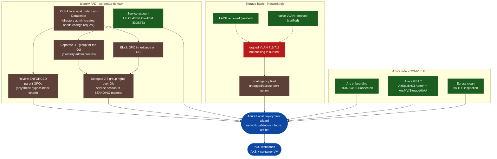

# Azure Local POC - Accounts and Service Dependencies

Last updated: 2026-07-21

This maps how every dependency flows into the Azure Local deployment. Colors:
green = done, brown = in progress, red = blocked/parked, blue = gate/milestone.
See STATUS.md for the running status board.

## Flow diagram

## Dependency status

| # | Item                                                | Who / system                      | Status      |
|---|-----------------------------------------------------|-----------------------------------|-------------|
| 1 | Arc onboarding (4 POC nodes Connected)              | Us / Azure                        | DONE        |
| 2 | Azure RBAC (AzStackHCI Admin + Arc/KV/Storage/UAA)  | Us / Azure                        | DONE        |
| 3 | Egress has no TLS inspection                        | Us (verified per endpoint)        | DONE        |
| 4 | LACP removed on storage ports                       | Network role                      | DONE        |
| 5 | Native VLAN removed on storage ports               | Network role                      | DONE        |
| 6 | Tagged VLAN 711/712 passes east-west               | Network role                      | PARKED (a)  |
| 7 | Service account AZLCL-DEPLOY-ADM (LCM user)         | Directory role                    | DONE        |
| 8 | Separate JIT group for the OU                       | Directory admin (JIT)             | in progress |
| 9 | Create OU under Lab-Datacenter (+ change request)   | Directory admin                   | in progress |
| 10| Block GPO inheritance on the OU                     | Directory admin                   | in progress |
| 11| Review ENFORCED parent GPOs for conflicts           | Us + directory admin              | in progress |
| 12| Delegate JIT group rights over OU (svc acct standing)| Directory admin                   | in progress |

(a) PARKED: our tagged-VLAN test fails, but configs are confirmed correct and our
    test method may not match Network ATC's SET path. Plan = let the deployment's
    network validation be the arbiter; contingencies in
    archive/docs/network/storage-fabric-fallback-if-deploy-fails.txt.

## Notes and constraints (current)

- Service account already exists: CORP\AZLCL-DEPLOY-ADM in
  OU=Service,OU=ServiceAccounts,OU=Identity. It does NOT need to move into the
  AzureLocal OU - the LCM user can reside anywhere in the directory; it just needs
  delegated rights OVER the OU.
- JIT: the OU rights are granted to a JIT group. Human admins are JIT-eligible
  members; the service account must be a STANDING (permanent) member, because Azure Local uses
  it UNATTENDED for lifecycle ops and cannot perform a JIT activation at runtime.
- Interactive/batch logon is NOT a directory account attribute and needs NO governance
  exception. "Allow log on locally" + "Log on as a batch job" are user-rights
  enforced on the CLUSTER NODES, governed by GPO on the (blocked-inheritance) OU.
  So the earlier "interactive-logon governance exception" item is dropped.
- GPO review: block-inheritance stops normally-inherited GPOs; only ENFORCED
  parent GPOs still reach the nodes. Review those for: deny logon rights, service
  disablement, WinRM/firewall lockdown, TLS/cipher hardening, forced CredGuard/VBS,
  LAPS. Ideally NO new GPO on the sub-OU (keep it clean); add one only if an
  Enforced GPO denies the two required logon rights.
- Objects in the OU: the physical node computer accounts (01/02/04/06) + the
  cluster name object (CNO). NOT tenant/workload VMs (those are Arc/Azure-managed).
- NoSync branch is fine: Azure auth is via Arc/Entra managed identities, not
  AD-to-Entra sync (nodes are already Arc-Connected as proof).
- Account maintenance: service account password expires 2027-01-17 (rotate + update in Azure
  Local before then); account expires 2027-07-21 (Extend before then).
- New-HciAdObjectsPreCreation is NOT used (it would create a second user). Manual
  path: create OU, block inheritance, delegate the existing service account + JIT group.
  https://learn.microsoft.com/en-us/azure/azure-local/plan/configure-custom-settings-active-directory

## Sequence

1. (DONE) Arc + RBAC + service account created; LACP/native removed on switch.
2. Directory admin: change request -> create OU under Lab-Datacenter, block inheritance, create the
   separate JIT group, delegate it rights over the OU, add the service account as standing member.
3. Review ENFORCED parent GPOs; only add a sub-OU GPO if one denies the two logon
   rights.
4. Run the Azure Local deployment wizard with the OU DN + the service account credential.
   Its network validation is the authoritative test of the storage fabric; if it
   flags storage, apply the filed fabric contingencies.
5. Post-deploy: POC workloads (AKS, container VM).

## Already in place (not human-blocked)

- Azure RBAC, Arc onboarding (4 nodes Connected), clean egress, the service account,
  LACP + native VLAN removed on the storage switches.

