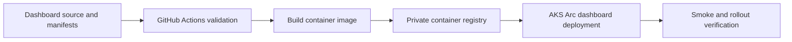

# Pipelines

This folder is the isolated CI/CD area for the Azure Local POC.

It is intentionally separate from the broader workspace. The current goal is to version and automate the Kubernetes-hosted Azure Local dashboard without prematurely importing all POC notes, point-in-time output, drivers, media, or credentials into GitHub.

## Current intended flow

## Planned pipeline stages

1. Validate Kubernetes manifests and dashboard source.
2. Build the dashboard container image.
3. Push an immutable image tag to a private registry.
4. Apply the dashboard deployment to `azl-cluster-01-aks-01`.
5. Wait for rollout and perform an internal HTTP probe.
6. Later, verify the MetalLB VIP after `Microsoft.KubernetesRuntime` is registered and MetalLB is configured.

## Security model

- GitHub Actions should use Azure workload identity federation, not stored Azure client secrets.
- The build identity needs only image-push permission to the selected registry and deployment rights needed for the dashboard namespace.
- The dashboard runtime identity is separate and read-only at `rg-azlocal-poc-001`.
- No credential from `.creds/`, no administrator kubeconfig, and no cluster-host credential belongs in GitHub or a workflow.

## Git scope

The current repository contains only the remote starter README plus the files you explicitly choose to stage. Do not bulk-add the workspace.

The eventual management-facing repository should be curated from source, runbooks, decisions, plans, manifests, and reproducible evidence. It must exclude `out/`, `DRIVERS/`, `media/`, `.creds/`, and other local/generated artifacts.

