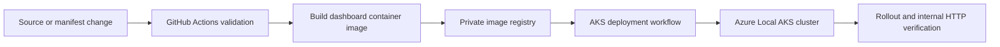

# Repository and GitHub Actions guide

## Purpose

This repository is the curated engineering record for the Azure Local proof of concept. It is not a direct backup of the working directory and it is not a source for host credentials, downloaded media, or generated test output.

The intended audience is the project team first, then management and future operators who need to understand what was built, why key decisions were made, what is proven, and how to reproduce a focused capability demonstration.

## What belongs in GitHub

| Include | Why |
|---|---|
| `decisions/` | Records meaningful technical and scope decisions with their evidence and rationale. |
| `docs/planning/` | Defines the build plan, test boundaries, capacity constraints, and next work. |
| `docs/runbooks/` | Provides human-reproducible commands, expected outcomes, and recovery notes. |
| `infra/` | Contains reviewed infrastructure definitions and dashboard templates. |
| `scripts/` | Contains reusable, reviewed automation with no embedded secrets. |
| `tests/` | Contains Kubernetes manifests, Dockerfiles, fixture data, and validation artifacts. |
| `pipelines/` | Contains GitHub Actions workflow definitions and pipeline documentation. |
| Curated evidence | Small sanitized reports or screenshots that demonstrate a conclusion. |

## What stays local

| Exclude | Reason |
|---|---|
| `.creds/` | DPAPI credentials, keys, and other authentication material. |
| `out/` | Generated logs, kubeconfigs, images, local tools, and point-in-time output. |
| `DRIVERS/` and `media/` | Large redistributable binaries, ISOs, and local installation artifacts. |
| Raw host or customer data | May contain network, identity, or operational information not intended for the repository. |
| Administrator kubeconfigs and certificates | Grant access to the Kubernetes cluster and must never be committed. |

The `.gitignore` establishes these defaults. Before a first broad import, review every proposed staged file. Do not use a bulk `git add .` as a shortcut.

## How GitHub Actions fits this POC

GitHub Actions has value where work can be validated or deployed repeatably from source. It does not replace Azure Local host administration, switch configuration, PIM activation, or physical hardware work.

### Good GitHub Actions uses

- Validate PowerShell parsing, Bicep syntax, Docker build structure, and Kubernetes manifests.
- Build a versioned dashboard container image.
- Publish an immutable image tag to a private registry.
- Apply the dashboard manifests to AKS after an explicit deployment approval.
- Verify Deployment rollout, pod readiness, and an internal HTTP response.
- Produce a small deployment summary attached to the workflow run.

### Poor GitHub Actions uses

- Direct host reboots, Azure Local cluster deployment, storage maintenance, BIOS work, or switch changes.
- Keeping standing host-admin credentials in repository or GitHub secrets.
- Automatic hard node-failure testing.
- Blindly applying Bicep, Terraform, or Kubernetes changes without a narrow deployment scope and review.

## Identity model

The intended pipeline identity design is deliberately separated by responsibility:

| Identity | Scope | Purpose |
|---|---|---|
| GitHub Actions deployment identity | Dashboard deployment scope only | Push image, update dashboard manifests, query rollout status. |
| Dashboard runtime identity | Reader at `rg-azlocal-poc-001` only | Read Azure Local, Arc VM, gallery image, and AKS inventory. |
| Kubernetes ServiceAccount | Dashboard namespace only | Read dashboard Deployment, pods, Service, and ConfigMap state. |
| Human PIM role | Time-limited and interactive | Azure Local operations, diagnostics, and explicit infrastructure changes. |

Use GitHub OIDC workload identity federation for Azure access. Do not use an Azure client secret stored in GitHub.

The dashboard runtime identity must not receive Contributor, User Access Administrator, Azure Stack HCI Administrator, Key Vault data roles, host credentials, or an administrator kubeconfig.

## Incremental adoption

1. Start with source-only CI: manifest validation and container build.
2. Add a private image registry and image-push permission for the GitHub deployment identity.
3. Add an approval-gated AKS deployment workflow for the dashboard namespace only.
4. Add MetalLB VIP smoke verification after `Microsoft.KubernetesRuntime` is registered.
5. Curate broader POC documentation and selected reusable scripts over time.
6. Create management-facing summaries from the curated source and findings, not raw terminal output.

## Day-to-day workflow

1. Make a narrow change in the working directory.
2. Run the smallest relevant local validation.
3. Review the actual files intended for Git.
4. Stage only those files.
5. Commit with a concise description of the capability or decision.
6. Push a branch or `main` according to the chosen review model.
7. Let GitHub Actions validate source changes. Keep deployment actions separately approved.

## Current dashboard pipeline state

- AKS cluster and dashboard fixture workload are running.
- The dashboard is currently accessed through a local `kubectl port-forward` from DECKARD.
- `Microsoft.KubernetesRuntime` remains the provider-registration gate for MetalLB and a management-subnet VIP.
- `.github/workflows/validate.yml` provides source-only CI for Terraform, Kubernetes manifests, and PowerShell
    parsing. It has no Azure credentials and performs no deployment.
- No private registry or GitHub deployment identity has been created yet.
- The `pipelines/` folder is the correct place to document future image-publishing and approval-gated deployment
    artifacts when the registry and identity choices are made.

