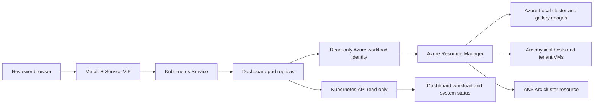

# Kubernetes-hosted Azure Local status dashboard

The first real workload on the cluster, and the hello world that proves the environment actually works.
Everything before this point demonstrates that infrastructure exists. This demonstrates that it can host and
serve something.

This is separate from the capstone. It was the proof needed to design the capstone, which is why it belongs with
the environment documentation rather than with the product material in `capstone/`.

## Purpose

Build a useful application on `azl-cluster-01-aks-01` that runs in Kubernetes but displays the state of the Azure Local environment hosting it.

The POC proves:

- Kubernetes schedules and restarts a real application workload.
- A pod uses a read-only Azure identity to query the Azure control plane.
- The application displays Azure Local cluster, VM, AKS, gallery image, and workload state.
- The application can be exposed through a MetalLB Service VIP after task S7 completes.

This dashboard is a companion to the Azure Monitor Workbook. It is not a replacement for supported operational monitoring.

## Safety boundary

The dashboard is strictly read-only. It must never create, update, delete, restart, migrate, or otherwise mutate Azure Local, AKS, Arc VM, or Kubernetes resources.

Do not place PIM credentials, admin kubeconfig, Key Vault secrets, host credentials, Contributor, User Access Administrator, or Azure Stack HCI Administrator roles in the application.

## Architecture



## Dashboard content

| Section | Source | Minimum fields |
|---|---|---|
| Azure Local cluster | ARM / Resource Graph | Cluster name, connected state, region, four-node scope. |
| Physical hosts | Arc machines | Host name, Arc status, OS/build, agent version. |
| Tenant VMs | Arc plus Azure Local VM ARM resources | Name, role/slot, guest OS, host node, provisioning and power state. |
| Gallery images | Azure Local gallery resources | Image name, OS, provisioning state. |
| AKS Arc | Connected cluster and provisioned instance | AKS version, state, worker count, API endpoint. |
| Kubernetes workload | Kubernetes API | Desired and available replicas, pod status/restarts, Service VIP state. |
| POC limits | Static app configuration | Four-node POC scope, no production HA claim, capacity boundaries. |

## Data access

### Azure

Create a dedicated Microsoft Entra workload identity or supported equivalent with **Reader** at `rg-azlocal-poc-001` only.

The backend queries Resource Graph or ARM for these resource types:

```kusto
Resources
| where resourceGroup =~ 'rg-azlocal-poc-001'
| where type in~ (
  'microsoft.azurestackhci/clusters',
  'microsoft.azurestackhci/galleryimages',
  'microsoft.azurestackhci/marketplacegalleryimages',
  'microsoft.hybridcompute/machines',
  'microsoft.kubernetes/connectedclusters')
| project name, type, kind, location, tags, properties
```

Use the Azure Local VM ARM resource endpoint for power state and host placement because Resource Graph does not reliably index those VM runtime fields.

### Kubernetes

Use a Kubernetes ServiceAccount with a Role/RoleBinding granting only `get`, `list`, and `watch` for the objects the dashboard displays. Start with the dashboard namespace and add other read-only namespace scopes only when required.

Do not mount an administrator kubeconfig in the pod.

## Application shape

- One small frontend/backend deployment, not a multi-service platform.
- Two replicas after the single-worker cluster demonstrates capacity.
- Initial resource profile: `100m` CPU and `128Mi` memory per pod.
- Azure data refresh on a conservative 60-second interval.
- Cache the last successful Azure response so temporary API errors do not blank the page.
- Show data freshness and visible stale/error state.

Do not add Prometheus, Grafana, a database, Log Analytics ingestion, historical metrics, or alerting in the first version.

## Delivery phases

### Phase 1 - Static workload

Deploy a dashboard UI with fixture data.

Pass:

- Two dashboard pods Running.
- One deleted pod is recreated.
- Application reachable through ClusterIP.

Status: complete on 2026-08-17.

- Deployment: `azure-local-dashboard`, two replicas `Running`.
- Service: `azure-local-dashboard`, ClusterIP `10.30.1.58:80`.
- The static UI is served by `mcr.microsoft.com/azure-cli:latest` using Python HTTP server and the
  `azure-local-dashboard-ui` ConfigMap.
- An in-cluster HTTP probe confirmed the rendered `Azure Local Status` page title.
- The initial content is fixture inventory only; it has no Azure write capability and no Azure identity.

### Phase 2 - Live Azure inventory

Attach the dedicated read-only Azure identity using a supported AKS Arc identity mechanism. Replace fixture data with ARM and Resource Graph data.

Pass:

- Dashboard displays Azure Local cluster, host inventory, tenant VMs, and gallery images.
- Dashboard visibly handles a temporary Azure API error.
- Application identity has no write-capable Azure role.

### Phase 3 - Kubernetes self-observation

Add read-only Kubernetes API data for the dashboard Deployment, pods, Service, and AKS worker node.

Pass:

- Dashboard displays desired and available replica counts.
- Dashboard reflects a deliberately deleted dashboard pod after replacement.

### Phase 4 - External presentation

After `Microsoft.KubernetesRuntime` is registered and MetalLB is configured, expose the dashboard Service as `LoadBalancer` using a VIP from `.221-.223`.

Pass:

- Dashboard receives a reachable VIP.
- Page loads from a management-subnet client.
- Page displays Azure and Kubernetes data freshness.

## Demonstration sequence

1. Open the dashboard through its Service VIP.
2. Show four Azure Local hosts and Arc status.
3. Show the running Core Windows Server VM and host placement.
4. Show imported Server 2025 Core and Desktop gallery images.
5. Show the dashboard deployment replica count and AKS worker status.
6. Delete one dashboard pod.
7. Refresh after replacement and show desired replicas restored.

## Prerequisites

- AKS cluster, workload scheduling, manual scale, and self-healing: complete.
- `Microsoft.KubernetesRuntime` registration: pending at subscription scope.
- MetalLB extension and `.221-.223` VIP pool: pending provider registration.
- Dedicated read-only Azure identity: needs creation and Reader assignment at RG scope.
- AKS Arc workload identity: validate support before implementation. If unavailable, use the least-privileged supported identity mechanism and document the trade-off.

## Prepared artifacts

The Kubernetes-only read-only foundation is staged and does not create an Azure identity or workload:

- `tests/kubernetes/azure-local-dashboard/00-namespace-and-rbac.yaml`: dashboard namespace, ServiceAccount, and namespace-scoped read-only Role/RoleBinding.
- `tests/kubernetes/azure-local-dashboard/10-fixture-configmap.yaml`: fixture inventory contract for the first UI version.
- `tests/kubernetes/azure-local-dashboard/README.md`: application-ready apply commands and safety constraints.

The remaining design choice before application code is Azure authentication. The dashboard must use a dedicated
Reader-only identity, never the developer's PIM session or an AKS administrator kubeconfig.

### Prepared in the live AKS cluster (2026-08-17)

The following Kubernetes-only artifacts were applied successfully to `azl-cluster-01-aks-01`:

- Namespace: `azure-local-dashboard`.
- ServiceAccount: `azure-local-dashboard`.
- Role and RoleBinding: `dashboard-read-status`, limited to `get`, `list`, and `watch` for pods, services,
  ConfigMaps, Deployments, and ReplicaSets in the dashboard namespace only.
- ConfigMap: `dashboard-fixture-data`, containing the initial UI inventory contract.

No dashboard pod, Azure identity, external Service, VIP, or write-capable permission has been created.

## Ready-to-build checklist

| Item | Status |
|---|---|
| AKS cluster and worker scheduling | Complete. |
| Dashboard namespace and Kubernetes read-only RBAC | Complete. |
| Dashboard fixture data contract | Complete. |
| Local `kubectl` and `kubelogin` tooling | Complete in `out/tools`. |
| MetalLB provider registration and VIP | Pending `Microsoft.KubernetesRuntime` registration. |
| Dedicated Azure Reader-only identity | Pending design choice and creation. |
| Dashboard application implementation | Pending user choice of application stack and presentation style. |

## Out of scope

- Continuous host CPU, memory, disk latency, or network telemetry from Azure Local nodes.
- Docker container inventory inside `rocky-docker-01`.
- Remediation buttons or write actions.
- Production authentication, SSO UX, alerting, historical metrics, database persistence, or disaster recovery.
