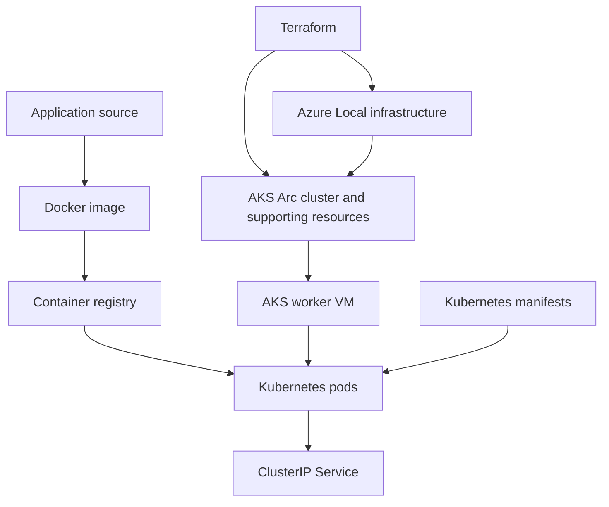
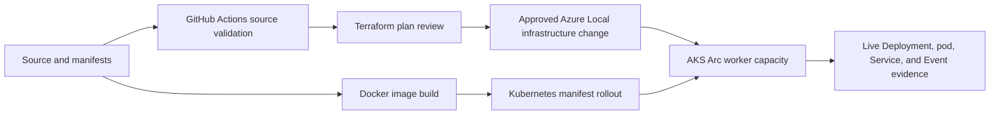

# Terraform, Docker, AKS, and Azure Local responsibility model

## Sprint closure summary

This POC proved the layers needed to deliver a containerized application on Azure Local. Terraform, Docker,
AKS, and Kubernetes work together, but each has a separate responsibility.

> Terraform defines the Azure Local and AKS infrastructure contract, Docker packages the application, and Kubernetes continuously reconciles the application's desired state across the available AKS worker capacity.

## Layered architecture



## What each layer does

| Layer | Responsibility | POC evidence |
| --- | --- | --- |
| Azure Local | Physical hosts, Storage Spaces Direct, networking, and Hyper-V foundation for AKS VMs and tenant VMs. | Four-node cluster deployed; clustered VM lifecycle and recovery behavior demonstrated. |
| Terraform | Infrastructure as code for Azure resources. It plans, creates, reconciles, and cleans up explicitly Terraform-owned resources. | Planned, created, verified, and removed the `tf-poc-linux-01` Arc machine, NIC, and VM extension. |
| Docker image | Packages application code and dependencies into a portable runtime artifact. | Current dashboard uses a Microsoft-maintained container image; custom image build is the next delivery layer. |
| AKS Arc | Kubernetes control plane and worker VMs running on Azure Local. | AKS `1.33.5` cluster is running with one control plane and one worker. |
| Kubernetes manifests | Declare how an image runs: Deployment, replicas, probes, Service, resource limits, and namespace RBAC. | Dashboard Deployment, ClusterIP Service, read-only ServiceAccount, and health probes are live. |
| Kubernetes controller loop | Schedules and reconciles pods toward the desired state. | Dashboard scaled `2 -> 3 -> 2`; deleted pod was replaced; EndpointSlice membership followed ready pods. |
| GitHub Actions | Validates source changes and later coordinates approved handoffs between infrastructure and application delivery. | Credential-free validation workflow exists for Terraform, Kubernetes manifests, and PowerShell syntax. |

## Important distinction

Terraform does not directly distribute Docker containers across the cluster. Kubernetes does that.

```text
Terraform:
  Creates or configures infrastructure resources.

Docker:
  Packages the application into an image.

Kubernetes:
  Schedules, replicates, routes to, and replaces application containers.

GitHub Actions:
  Validates each layer and coordinates approved transitions between them.
```

Terraform can manage Kubernetes objects through a Terraform Kubernetes provider, but that is not the selected
first design for this POC. Keeping Terraform focused on Azure infrastructure and Kubernetes manifests focused on
the application produces clearer ownership, cleaner state boundaries, and a more understandable presentation.

## POC delivery flow



## What the sprint closes

- Terraform can manage an isolated Azure Local VM lifecycle without changing cluster foundation or manually built workloads.
- AKS Arc can run a two-replica application workload on Azure Local.
- Kubernetes can scale the workload, maintain ready Service endpoints, and replace a deleted pod.
- The current source-validation workflow can check Terraform configuration, Kubernetes manifests, and PowerShell syntax without Azure credentials.
- The next phase is not basic capability discovery. It is controlled delivery integration: custom image build, pipeline evidence, remote Terraform state, GitHub OIDC, and approval-gated apply/destroy.

## Current boundaries

- The dashboard remains internal through ClusterIP and local `kubectl port-forward` because MetalLB requires a subscription provider registration that is intentionally not being escalated.
- Terraform VM runtime succeeded, but Azure Local ARM completion lagged the actual Hyper-V runtime state; the later pipeline design must account for this asynchronous behavior.
- The node 01 retired NVMe path remains a storage maintenance item. The POC can continue small, reversible work, but storage mutation and high-write or capacity-expansion tests remain deferred.
- This is a functional POC, not a production performance, HA, DR, or unrestricted automation certification.

## Related records

- [Terraform sprint plan](../../working/sprints/terraform-against-cluster.md)
- [Load balancer and scale set sprint plan](../../working/sprints/loadbalancer-scaleset.md)
- [Kubernetes and Terraform integration test results](kubernetes-terraform-integration-test-results.md)
- [Terraform and CI/CD capstone plan](../../capstone/terraform-cicd-plan.md)
- [Azure permissions and capability register](../access/azure-permissions-and-capability-register.md)

