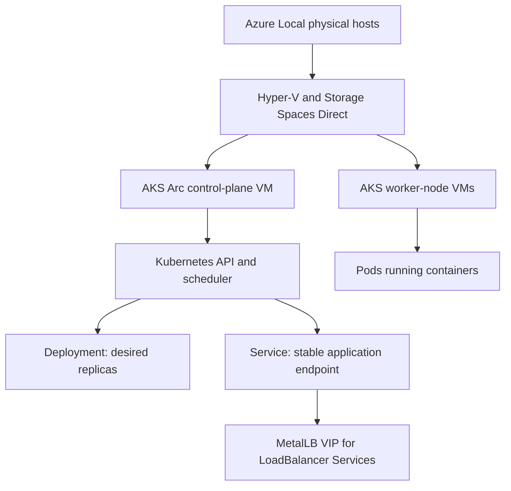

# AKS on Azure Local and scale demonstration work plan

## Purpose

This plan joins task S5, Deploy AKS on Azure Local and validate, with task S7, Validate load balancer and scale set compatibility.

The goal is a small, truthful capability demonstration on `AZL-CLUSTER-01`:

1. Run a Kubernetes cluster on Azure Local.
2. Schedule and self-heal a simple container workload.
3. Expose the workload through an AKS Arc LoadBalancer Service VIP.
4. Demonstrate workload replica scaling.
5. Attempt a small node-pool scale only if live host capacity supports it.

This is not a production Kubernetes rollout, HA certification, throughput test, or VM Scale Set implementation.

## Follow-on workload

After the base AKS and MetalLB proofs, the recommended application workload is a Kubernetes-hosted, read-only Azure Local status dashboard. It runs in AKS but queries the Azure control plane and its own Kubernetes state to show cluster, host, VM, image, AKS, and workload availability.

Detailed plan:
- docs/planning/kubernetes-self-referential-dashboard.md

## Plain-language model

Azure Local provides the physical hosts, Hyper-V, Storage Spaces Direct, and tenant networking. AKS Arc creates Kubernetes control-plane and worker-node VMs on that platform. Kubernetes then schedules application pods onto its worker nodes.



In this POC, the control plane manages desired state, worker nodes run the pods, Storage Spaces Direct
keeps the VM disks available to the Azure Local cluster, and MetalLB supplies the management-subnet VIP
for a Kubernetes `LoadBalancer` Service.

For the two tasks, use the following equivalence table:

| Desired capability | Azure Local / AKS implementation | Not available as an Azure Local resource |
|---|---|---|
| Application load balancing | Kubernetes Service type `LoadBalancer` with an AKS Arc VIP | Azure Standard Load Balancer |
| Many copies of an application | Kubernetes Deployment replicas and HPA | VM Scale Set |
| More Kubernetes worker capacity | AKS node-pool scale | VMSS instance count |
| More general-purpose VMs | Explicit Arc VM creation | Managed VMSS orchestration |

## Current facts and constraints

| Item | Current state |
|---|---|
| Azure Local cluster | Four nodes: 01, 02, 04, 06; deployed and healthy after the 2026-08-13 reboot-recovery test. |
| Existing VM workload | `ws2025-core-01` runs on node 02; `rocky-docker-01` runs on node 06. |
| Node 06 capacity | Only 5.5 GB free on 2026-08-14 because Arc infrastructure consumes about 12 GB. |
| Node 01 capacity | 24.5 GB free at last measurement. |
| Node 02 capacity | 14.4 GB free at last measurement. |
| Node 04 capacity | 18.2 GB free at last measurement. |
| Desktop VM evidence | A 4 GB Desktop Experience VM could not start when placed on node 06: Hyper-V `0x8007000E`, insufficient memory. |
| Tenant IP range | `.208-.219` is allocated to tenant VMs; `.220-.228` is held for AKS nodes and LoadBalancer VIPs. |
| Marketplace | `Microsoft.EdgeMarketplace` registered; Windows Server 2025 Azure Edition Core image imported successfully. |

## Discovered AKS Arc capability (2026-08-14)

The following was queried from the actual custom location, not inferred:

```powershell
az aksarc get-versions -g rg-azlocal-poc-001 --custom-location azl-cluster-01-cl -o json
```

| Finding | Result |
|---|---|
| Existing AKS Arc clusters | None. |
| Existing AKS Arc virtual networks | None. |
| Supported stable Kubernetes patch versions | `1.31.12`, `1.31.13`, `1.32.8`, `1.32.9`, `1.33.4`, `1.33.5`. |
| Recommended initial version | `1.33.5`, latest stable version currently offered by this custom location. |
| Ready worker operating system | CBL-Mariner Linux. |
| Windows worker nodes | Not enabled on this custom location. Windows Server 2019 is deprecated and Windows Server 2022 worker support is disabled. |
| Client-side validation | `az aksarc create --validate` exists and must be used before a create request. |
| AKS Arc creator RBAC | `Azure Kubernetes Service Arc Contributor Role` at `rg-azlocal-poc-001`, assigned 2026-08-14. It grants both `Microsoft.Kubernetes/connectedClusters/write` and `Microsoft.HybridContainerService/provisionedClusterInstances/write`. |

Implication: AKS validates the container platform with Linux workers. Windows Server 2025 remains a separate
Arc VM test surface, not a Kubernetes worker-node target in this POC.

## AKS build result and LoadBalancer correction (2026-08-14)

The initial minimal AKS cluster build succeeded:

| Item | Observed result |
|---|---|
| Cluster | `azl-cluster-01-aks-01` reached `Succeeded`. |
| Kubernetes | `1.33.5`, Azure Linux/CBL-Mariner control plane and one Linux worker. |
| Node IPs | Control plane `.211`, worker `.212`; API endpoint `.220`. |
| Workload | Two `aci-helloworld` replicas scheduled successfully from MCR. |
| Self-healing | Deleting a pod caused its Deployment to replace it successfully. |
| Manual workload scale | One replica -> two replicas succeeded. |
| ClusterIP | Allocated `10.60.1.132`. |

Correction to the original S7 assumption: this AKS Arc version does not support a managed
`--load-balancer-count` VM. The CLI accepts only the default count of `0`. The supported Azure Local
LoadBalancer implementation is the **MetalLB Azure Arc extension**, using an IP pool on the cluster
logical-network subnet and ARP advertisement for this POC.

Planned MetalLB pool: `.221-.223` on `10.10.0.0/22`, separate from the API endpoint `.220`, tenant VM
pool `.208-.219`, and Azure Local infrastructure pool `.200-.207`.

### Current blocking prerequisite for MetalLB

`Microsoft.KubernetesRuntime` is `NotRegistered` on subscription `00000000-0000-0000-0000-000000000001`.
The MetalLB `k8s-runtime` extension is installed locally, but its provider registration is required before
the extension and IP pool can be created.

Attempted command:

```powershell
az provider register -n Microsoft.KubernetesRuntime
```

Confirmed result on 2026-08-18:

```text
AuthorizationFailed: missing Microsoft.KubernetesRuntime/register/action at subscription scope.
```

The Azure Kubernetes Service Arc Contributor Role was sufficient for AKS cluster creation at RG scope; it
does not grant subscription provider registration. The active UAA assignment is also RG-scoped, so it cannot
grant this subscription action. No safe RG-scoped workaround exists.

Current POC decision: do not request this external subscription action. Keep workload exposure at `ClusterIP`
and use a temporary local `kubectl port-forward` when needed. MetalLB and the `.221-.223` ARP pool remain a
documented future capability, not a current POC deliverable. See
[external dependencies and POC lessons](../../docs/planning/external-dependencies-and-poc-lessons.md) for the full third-party
engagement and preflight record.

The memory numbers are a planning snapshot, not a reservation. Re-measure immediately before provisioning AKS.

### Potential capacity improvement - balance memory across active nodes

The active nodes do not need identical RAM totals for Azure Local to operate. However, the node 06 placement
failure shows that uneven headroom weakens the POC's ability to place VMs and demonstrate scale reliably.

One possible capstone improvement is to redistribute compatible DIMMs from the two unused physical nodes to
the four active cluster members, aiming for equal total memory and balanced CPU memory-channel population on
nodes 01, 02, 04, and 06. This is a hardware change, not an Azure configuration change.

Do not perform this work until the following preflight is captured:

- DIMM slot, capacity, speed, rank, manufacturer, and part number for all six nodes.
- Dell Precision 7960 Rack supported population rules and compatible DIMM combinations.
- A proposed channel-balanced layout for every active node, reviewed before any DIMM is moved.
- Current host free memory, VM assigned memory, and Azure Local health baseline.
- A decision that nodes 03 and 05 are being treated as DIMM donors rather than near-term recovery or scale-out nodes.

After any change, run the full Azure Local hardware validator on all four active nodes and capture a new
capacity baseline before attempting an AKS worker-node scale or a Terraform-owned disposable VM.

## Future capacity option - onboard an extra physical node

An extra physical Azure Local-capable node exists but is not a member of the deployed four-node cluster.
It cannot directly act as an AKS Arc load-balancer host: AKS Arc places managed control-plane, worker,
and load-balancer VMs only on Azure Local cluster members.

Adding the spare later is a true Azure Local scale-out operation, not an AKS setting. It is worth considering
for additional compute and memory headroom, broader VM placement, and future AKS node-pool/load-balancer
capacity. It must be independently planned because Azure Local requires node hardware, storage drive count,
network adapters, OS/solution version, domain state, and cluster validation to be compatible before an add.

Current decision: do not make tasks S5 or S7 depend on adding the spare. Complete the smallest
AKS proof on the existing four-node cluster first, and preserve the spare-node assessment as a later
capacity-expansion workstream.

## Working assumptions to validate

- A minimal AKS control plane and one small worker node can fit while retaining room for Azure Local infrastructure and the existing Core VM.
- The reserved `.220-.228` range can supply an AKS control-plane address, node addresses, and at least one LoadBalancer VIP without colliding with other reservations.
- The existing management network and DNS servers can reach the AKS nodes.
- The AKS Arc extension supports a Kubernetes version and small node-pool size compatible with the Azure Local cluster.

If any assumption fails, record it as the POC capacity or networking boundary. Do not force placement by overcommitting the hosts.

## Phase 0 - Agree the test envelope

Before provisioning, agree these choices:

| Decision | Recommended POC starting point | Why it matters |
|---|---|---|
| Initial worker-node count | 1 | Lowest memory and IP footprint; enough to prove cluster creation and workload scheduling. |
| Scale target | 2 worker nodes, conditional | Demonstrates the node-pool equivalent of scale-out only if live capacity supports it. |
| Workload | Two-replica HTTP echo or NGINX service | Easy to inspect, restart, scale, and expose. |
| Initial Service type | ClusterIP | Separates basic Kubernetes proof from VIP/network complexity. |
| LoadBalancer test | One service, one VIP | Proves task S7 without exhausting the reserved VIP range. |
| Autoscaling | Manual replica scale first; HPA optional | HPA needs metrics plumbing and load generation; manual scale proves the core behavior first. |
| Existing VMs | Keep Core VM; do not add more general-purpose VMs | Avoids repeating the node 06 memory placement failure. |

## Phase 1 - Capacity and network preflight

### 1.1 Confirm cluster health

Run from a surviving Azure Local node or through the established domain-admin WinRM path:

```powershell
Get-ClusterNode
Get-StoragePool -IsPrimordial $false
Get-VirtualDisk
Get-StorageJob
```

Pass criteria:

- All four nodes are `Up`.
- Pool and virtual disks are `Healthy`.
- No active storage repair or rebalance job exists.

### 1.2 Re-measure host capacity

Capture total memory, free memory, and running VM allocation per node. Keep the output in `out/`.

Pass criteria:

- The proposed AKS control plane and workers fit without relying on node 06.
- The three-node survivor set can still carry the intended POC workload if one host is unavailable.

Stop condition:

- A proposed AKS node cannot be placed without overcommitting hosts or reducing healthy headroom to an unknown level.

### 1.3 Reserve and document AKS addresses

Confirm the exact use of `.220-.228` before creating resources:

| Address purpose | Planning count |
|---|---:|
| AKS control plane | 1 |
| Initial worker node | 1 |
| Conditional second worker | 1 |
| LoadBalancer VIP | 1 |
| Headroom | 5 |

Validate that the AKS address range does not overlap with:

- Azure Local infrastructure addresses `.200-.207`.
- Tenant VM range `.208-.219`.
- Kubernetes service CIDR `10.96.0.0/12`.
- Kubernetes pod CIDR `10.244.0.0/16`.

## Phase 2 - Discover supported AKS Arc inputs

Use the installed `aksarc` extension to obtain the actual inputs rather than guessing versions or node sizes.

```powershell
az aksarc get-versions --location southcentralus
az aksarc vnet list -g rg-azlocal-poc-001
az aksarc show --help
az aksarc nodepool --help
```

Record:

- Available Kubernetes versions.
- Required logical-network or arcnetwork parameters.
- Smallest supported control-plane and worker sizing.
- Required SSH-key, DNS, and load-balancer-range arguments.

Pass criteria:

- One supported Kubernetes version and a minimal node profile are identified.
- The required AKS network object can be mapped to the reserved IP plan.

## Phase 2A - Build or reuse the AKS Arc network object

AKS Arc expects an `aksarc vnet` resource that references a MOC virtual network. Do not create this until
the actual MOC network name is discovered from the Azure Local control plane. Do not guess `--moc-vnet-name`.

Discovery commands:

```powershell
az aksarc vnet list -g rg-azlocal-poc-001 -o json
az aksarc vnet create --help
az stack-hci-vm network lnet list -g rg-azlocal-poc-001 -o json
```

The installed `aksarc` CLI also accepts an Azure Local logical-network ARM ID directly as `--vnet-id`.
Use that direct path first because it avoids a legacy MOC group-name dependency and the existing tenant
logical network already maps to the intended management subnet.

Direct logical-network ID:

```powershell
$aksVnetId = az stack-hci-vm network lnet show `
	--resource-group rg-azlocal-poc-001 `
	--name AZL-CLUSTER-01-TenantLNET `
	--query id -o tsv
```

Validate the full AKS request against this ID before creating anything. Create a separate `aksarc vnet`
resource only if validation explicitly requires it.

Legacy fallback, only if required by validation: once the MOC network name is confirmed, create an AKS
network object using the custom location:

```powershell
az aksarc vnet create `
	--name azl-cluster-01-aks-vnet `
	--resource-group rg-azlocal-poc-001 `
	--custom-location azl-cluster-01-cl `
	--location southcentralus `
	--moc-vnet-name <confirmed-moc-network-name>
```

Then capture its ARM ID:

```powershell
$aksVnetId = az aksarc vnet show `
	--name azl-cluster-01-aks-vnet `
	--resource-group rg-azlocal-poc-001 `
	--query id -o tsv
```

Pass criteria:

- The AKS Arc virtual network resource reaches `Succeeded`.
- Its backing MOC network maps to the intended management subnet and the `.220-.228` allocation plan.

Stop condition:

- The MOC network cannot be unambiguously mapped to the approved management subnet and reserved AKS addresses.

## Phase 3 - Provision the smallest AKS cluster

Create a cluster with one worker node and the minimum supportable resource profile.

### 3.1 Validation-only request first

Use the discovered latest stable version and one worker node. The VM-size values must be confirmed from
the available AKS Arc sizing surface before this command is run. The control-plane IP must be an approved
address from `.220-.228`, routable from the Azure Arc Resource Bridge.

```powershell
az aksarc create `
	--name azl-cluster-01-aks-01 `
	--resource-group rg-azlocal-poc-001 `
	--custom-location azl-cluster-01-cl `
	--location southcentralus `
	--vnet-id $aksVnetId `
	--kubernetes-version 1.33.5 `
	--control-plane-count 1 `
	--node-count 1 `
	--control-plane-ip <approved-control-plane-ip> `
	--control-plane-vm-size <confirmed-smallest-supported-size> `
	--node-vm-size <confirmed-smallest-supported-size> `
	--ssh-key-value .\.creds\poc-vm-key.pub `
	--validate
```

Pass criteria:

- Validation completes without network, IP, version, or capacity errors.

### 3.2 Create after validation passes

Repeat the exact command without `--validate`. Do not enable cluster autoscaler, workload identity,
AI toolchain, or extra control-plane nodes in the first build. They add memory and configuration variables
without contributing to the initial POC success criteria.

```powershell
az aksarc create `
	--name azl-cluster-01-aks-01 `
	--resource-group rg-azlocal-poc-001 `
	--custom-location azl-cluster-01-cl `
	--location southcentralus `
	--vnet-id $aksVnetId `
	--kubernetes-version 1.33.5 `
	--control-plane-count 1 `
	--node-count 1 `
	--control-plane-ip <approved-control-plane-ip> `
	--control-plane-vm-size <confirmed-smallest-supported-size> `
	--node-vm-size <confirmed-smallest-supported-size> `
	--ssh-key-value .\.creds\poc-vm-key.pub
```

### 3.3 Connect and validate basic health

```powershell
az aksarc get-credentials -g rg-azlocal-poc-001 -n azl-cluster-01-aks-01
kubectl get nodes -o wide
kubectl get pods -A
```

Expected:

- The single CBL-Mariner Linux worker reports `Ready`.
- Core system pods become `Running`.
- No unschedulable-memory condition appears in `kubectl get events -A`.

Expected result:

- AKS Arc cluster resource reaches `Succeeded`.
- Control-plane endpoint is reachable from the DevBox.
- `az aksarc get-credentials` produces a usable kubeconfig.
- `kubectl get nodes` shows the initial worker as `Ready`.

Evidence:

- `out/_aksarc-create-<timestamp>.txt`
- `kubectl get nodes -o wide`
- Resource IDs, node IPs, and selected Kubernetes version.

Stop condition:

- Azure Local cannot place the initial AKS VM resources due to memory capacity.
- AKS network provisioning cannot consume the documented IP range cleanly.

## Phase 4 - Validate basic Kubernetes behavior

Apply the existing smoke manifests using ClusterIP only:

```powershell
kubectl apply -f tests/kubernetes/smoke
kubectl get pods -o wide
kubectl get service
```

Then prove desired-state self-healing:

```powershell
kubectl delete pod <one-smoke-pod>
kubectl get pods -w
```

Pass criteria:

- Requested pods become `Running`.
- Deleting one pod causes its Deployment/ReplicaSet to create a replacement.
- In-cluster traffic reaches the ClusterIP service.

## Phase 5 - Validate workload scale

First use explicit replica count, not HPA:

```powershell
kubectl scale deployment <deployment-name> --replicas=3
kubectl get pods -o wide
kubectl scale deployment <deployment-name> --replicas=2
```

Pass criteria:

- Kubernetes reaches three Ready replicas, then returns to two.
- Replica placement and readiness are visible.
- No host capacity warning or pod scheduling failure is ignored.

Optional follow-up:

- Enable metrics and configure an HPA only after manual scale passes. This is optional because it adds monitoring and load-generation variables beyond the basic scale proof.

## Phase 6 - Validate the AKS LoadBalancer equivalent

Create a single Kubernetes `Service` of type `LoadBalancer` for the smoke workload.

```powershell
kubectl apply -f <loadbalancer-service-manifest>
kubectl get service -w
```

Pass criteria:

- A VIP is assigned from the reserved AKS LoadBalancer range.
- The service responds from a management-subnet client.
- The VIP is recorded with its service and port.

Failure interpretation:

- `EXTERNAL-IP Pending`: investigate the AKS Arc load-balancer configuration and VIP range before changing the workload.
- Assigned VIP but unreachable: investigate subnet routing/firewall and service endpoints.

## Phase 7 - Conditional node-pool scale

Only run after phases 1-6 are green and after a new memory preflight.

Scale from one worker to two workers, then verify the new worker reaches `Ready`. Scale down only after confirming workload replicas remain available.

Pass criteria:

- New worker joins as `Ready`.
- Pods can schedule across workers where Kubernetes placement permits it.
- Scale-down drains/removes the worker cleanly.

Valid POC outcome if skipped:

- If live capacity cannot safely host a second worker, document the node-pool scale test as capacity-limited. The LoadBalancer and pod-replica tests remain valid demonstrations of the Azure Local AKS service and horizontal-workload model.

## Phase 8 - Optional resilience interaction

Do not combine this with initial AKS bring-up. After all earlier phases pass:

- Drain one AKS worker node first, then confirm workload replicas remain reachable through the Service VIP.
- A host reboot interaction is optional and must follow the no-go gates in `unplanned-node-recovery-boundary-plan.md`.

## Deliverables

- AKS creation record and selected version/network parameters.
- `kubectl get nodes`, pods, deployments, and services outputs.
- A smoke workload manifest with ClusterIP and LoadBalancer variants.
- VIP address and reachability evidence.
- Manual replica-scale output.
- Conditional node-pool scale result or capacity-limit evidence.
- A short conclusion that distinguishes demonstrated AKS capabilities from unavailable Azure public-cloud resources.

## Questions to settle before execution

1. Should `ws2025-core-01` remain running during AKS provisioning, or should it be stopped temporarily to preserve headroom?
2. Confirm `.220-.228` remains available for the AKS control plane, worker nodes, and VIP.
3. What is the acceptable upper bound for AKS-created VM memory on this POC?
4. Is a one-worker initial cluster acceptable for the first proof, with a second worker only as a capacity-gated scale test?
5. Should the first exposed application be a simple HTTP echo/NGINX service, or is there a more relevant internal workload to demonstrate?
