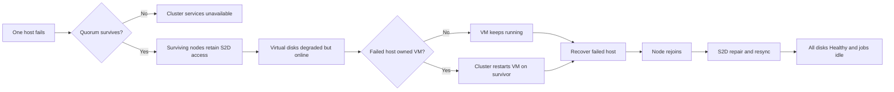

# Azure Local unplanned node recovery boundary plan

## Purpose

Define what the four-node Azure Local POC can safely prove about node-loss recovery, what has already been proven, and which claims remain out of scope because of the workstation-class hardware and POC operating model.

This plan covers a single node outage only. It does not certify production HA, DR, capacity, performance, or supportability.

## Current evidence

The following controlled test passed on 2026-08-13 with `ws2025-core-01`, a Windows Server 2025 Datacenter: Azure Edition Core VM:

| Test | Result |
|---|---|
| Planned live migration | VM stayed `Online` while ownership moved from `AZL-NODE-04` to `AZL-NODE-01`. |
| Current-host forced OS reboot | `AZL-NODE-01` went `Down`; the VM recovered on `AZL-NODE-02`. |
| Storage while node was down | Pool became `Warning`; six virtual disks became degraded/warning but remained online. |
| Recovery | Node rejoined after about 26 minutes; pool and all six virtual disks returned `Healthy`; repair jobs became idle. |

This proves a controlled host reboot can trigger clustered VM recovery and Storage Spaces Direct repair in the present POC configuration.

It does not prove behavior for sudden loss of power, storage-controller failure, switch failure, two-node loss, or a long-duration node outage.

## Hardware and scope constraints

- Functional cluster members are `AZL-NODE-01`, `AZL-NODE-02`, `AZL-NODE-04`, and `AZL-NODE-06`.
- Node 05 is a lower-storage spare and is not a planned failover-capacity node.
- The hosts are Dell Precision 7960 Rack workstations, not Azure Local-certified PowerEdge hardware.
- Each active host has constrained memory relative to production guidance. Do not assume all running VMs can be placed on the three surviving nodes without an explicit capacity check.
- Measured on 2026-08-14: node 06 had only 5.5 GB free while hosting 12 GB of Arc infrastructure; a 4 GB
  Windows Server 2025 Desktop VM could not start there (`0x8007000E`). Capacity and placement must be
  checked before adding or failing over more workloads.
- The POC has proven a single-node outage only. Do not fail two nodes together.
- The current Storage Spaces Direct layout tolerated one node becoming unavailable. The actual virtual-disk resiliency settings must be recorded before any hard power-loss test.

## Recovery model



The decision gates are quorum, online virtual disks, and enough survivor capacity to start the affected VM. Storage resiliency alone does not guarantee the VM can restart if the surviving nodes lack memory or compute headroom.

## Preflight gate before every resilience test

Run from a healthy cluster node using `sim\labadmin` credentials. Capture the output in `out/`.

```powershell
Get-ClusterNode | Format-Table Name, State -Auto
Get-ClusterQuorum | Format-List *
Get-StoragePool -IsPrimordial $false | Format-Table FriendlyName, HealthStatus, OperationalStatus, Size, AllocatedSize -Auto
Get-VirtualDisk | Format-Table FriendlyName, ResiliencySettingName, HealthStatus, OperationalStatus, Size -Auto
Get-StorageJob | Format-Table Name, JobState, PercentComplete -Auto
Get-ClusterGroup | Where-Object GroupType -eq VirtualMachine | Format-Table Name, OwnerNode, State -Auto
Get-VM | Select-Object Name, State, MemoryAssigned, ProcessorCount | Format-Table -Auto
```

All of the following must be true before a disruptive test:

- Four cluster nodes are `Up`.
- Storage pool is `Healthy`.
- All virtual disks are `Healthy` and `Online`.
- No active storage job exists.
- Quorum configuration is recorded and reports healthy.
- The test VM and any planned workloads can fit on the remaining three nodes if the selected host fails.
- A human has iDRAC/KVM access for a hard power-loss test.

Stop if any gate fails. Do not use an already degraded pool as a resilience-test starting point.

## Test ladder

### Level 0 - Observation only

Goal: capture the configuration and prove the recovery prerequisites without disruption.

Pass: all preflight gates are green and actual resiliency settings are recorded.

### Level 1 - Graceful maintenance drain

Goal: prove planned evacuation.

```powershell
.\scripts\Invoke-NodeFailureTest.ps1 `
  -TargetNode AZL-NODE-01 `
  -TargetFqdn azl-node-01.lab.example.com `
  -ConnectNode azl-node-02.lab.example.com `
  -Mode Drain `
  -Execute
```

Expected: roles live-migrate from the paused node; the pool and virtual disks stay `Healthy`; the node resumes successfully.

### Level 2 - Controlled OS reboot

Goal: prove automatic VM recovery and storage repair after a host becomes unavailable through a forced OS restart.

```powershell
.\scripts\Invoke-NodeFailureTest.ps1 `
  -TargetNode AZL-NODE-01 `
  -TargetFqdn azl-node-01.lab.example.com `
  -ConnectNode azl-node-02.lab.example.com `
  -Mode Reboot `
  -Execute
```

Expected: one node becomes `Down`; virtual disks can become degraded/warning but remain online; a VM hosted by the failed node restarts on a survivor; node and storage return to healthy.

Status: passed once on 2026-08-13 for `ws2025-core-01`.

### Level 3 - Manual hard power-loss test

Goal: distinguish forced OS reboot recovery from abrupt host loss.

This is manual only. It is never automated by the scripts.

1. Run the preflight gate and preserve its output.
2. Ensure a human is at iDRAC/KVM and knows how to power the selected node back on.
3. Confirm the selected node currently owns `ws2025-core-01`.
4. Hard power off only that one node through iDRAC.
5. Observe from a surviving node:

```powershell
Get-ClusterNode
Get-ClusterGroup -Name ws2025-core-01
Get-StoragePool -IsPrimordial $false
Get-VirtualDisk
Get-StorageJob
```

6. Power the node back on promptly.
7. Wait for the node to rejoin, repair jobs to complete, and all disks to return `Healthy`.

Pass: quorum remains, virtual disks remain online, VM restarts on a survivor, and repair returns the pool to healthy without manual storage action.

## Explicit no-go conditions

Do not perform the Level 3 test if any of the following are true:

- Any node is already down, paused, or being updated.
- Pool or virtual disks are not healthy.
- Repair or rebalance is in progress.
- The failed Desktop Experience gallery-image request is being retried or another MOC image operation is active.
- No one can reach iDRAC/KVM.
- More than one test VM or other workload would exceed three-node capacity after failover.
- The demonstration cannot tolerate a VM restart or a multi-minute recovery window.

## What to report after each test

- Starting and ending node states.
- Cluster quorum configuration and observed cluster availability.
- Pool and virtual-disk state during outage and after recovery.
- Test VM owner, state, and restart/failover result.
- Storage job names and time to idle.
- Total outage and recovery duration.
- Any manual intervention used.

## Interpretation boundaries

Passing Level 2 demonstrates recoverability from a controlled operating-system reboot in this POC.

Passing Level 3 would demonstrate one abrupt host-loss recovery scenario on the current hardware. It would still not demonstrate production readiness because this POC has no validated production capacity reserve, certified server hardware baseline, multi-failure test, switch-failure test, backup/restore test, or long-duration repair validation.
